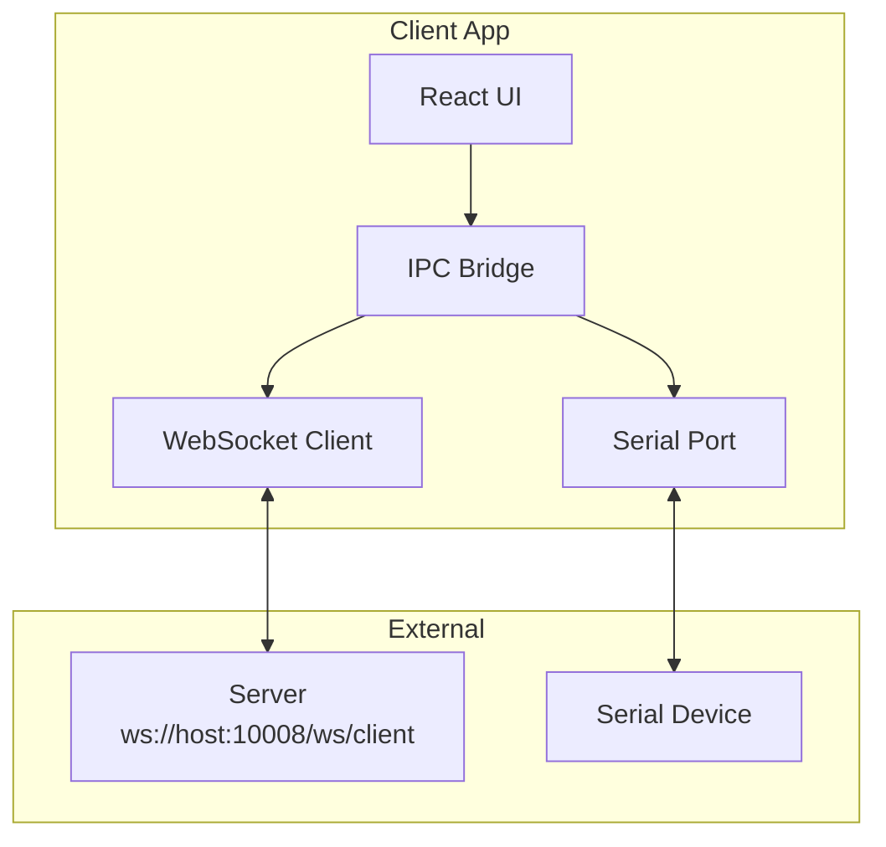
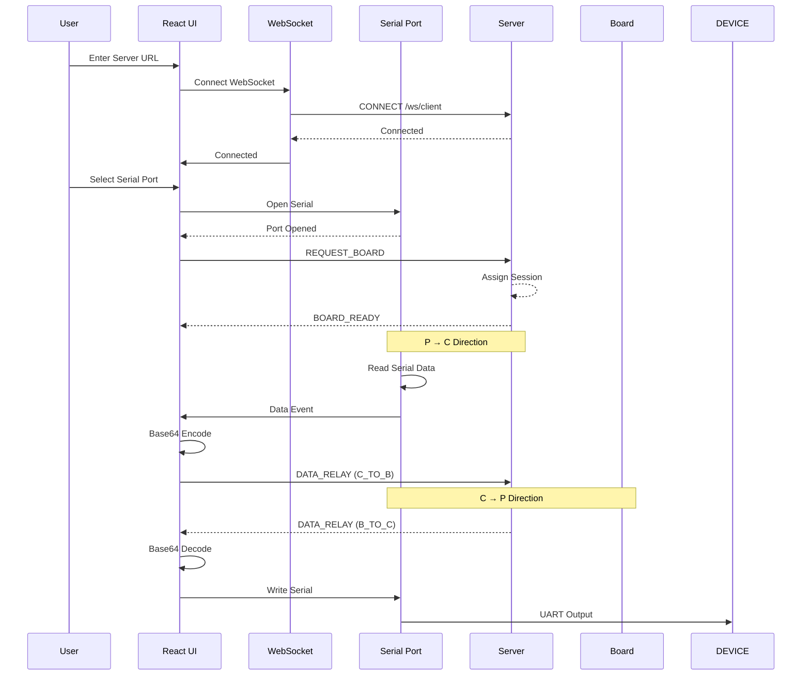
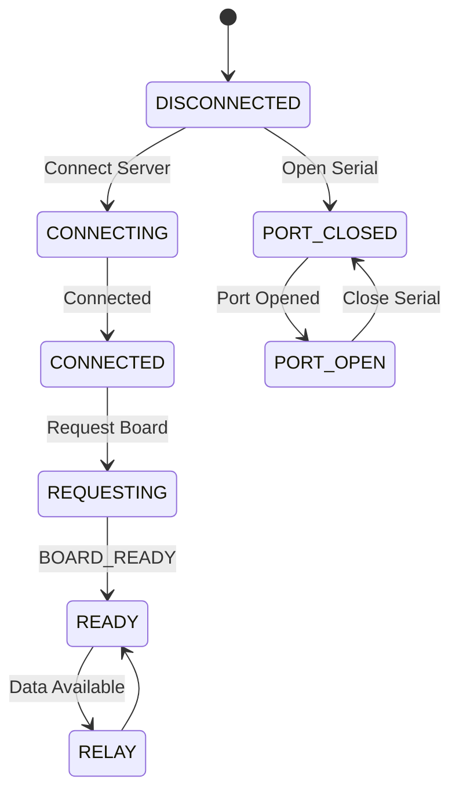

# Client App Design

## Overview

Electron desktop application that connects to the server via WebSocket and bridges data to/from a local serial port.

## Architecture



## Data Flow



## UI Layout

```
┌─────────────────────────────────────────┐
│           Nexio Client                  │
├─────────────────────────────────────────┤
│ ┌─ Server Connection ──────────────────┐ │
│ │ URL: [ws://localhost:10008/ws/client]│ │
│ │ [Connect] ● Connected              │ │
│ └───────────────────────────────────┘ │
│                                         │
│ ┌─ Serial Port ───────────────────────┐ │
│ │ Port: [COM3 ▼] Baud: [115200 ▼]     │ │
│ │ [Open Port] ● Port Open            │ │
│ └───────────────────────────────────┘ │
│                                         │
│ ┌─ Board Status ──────────────────────┐ │
│ │ Board: BOARD-0001                    │ │
│ │ Expires: 2024-01-01 12:00:00       │ │
│ └───────────────────────────────────┘ │
│                                         │
│ ┌─ Data Log ─────────────────────────┐ │
│ │ [12:00:00] TX: Hello World         │ │
│ │ [12:00:01] RX: Response data       │ │
│ └───────────────────────────────────┘ │
└─────────────────────────────────────────┘
```

## Key Features

### 1. Server Connection

- WebSocket client to server
- Auto-reconnect with exponential backoff
- Connection status indicator

### 2. Serial Port Management

- List available COM ports
- Select baud rate: 9600 - 921600
- Open/close port
- Read/write binary data

### 3. Board Request

- Request board from server
- Receive BOARD_READY
- Display assigned board ID
- Show session expiry time

### 4. Data Relay

- Serial → Server: Encode binary as Base64
- Server → Serial: Decode Base64 to binary

### 5. Data Log

- Real-time log of sent/received data
- Display mode: Text or Hex
- Clear log

## Message Protocol

### REQUEST_BOARD
```json
{
  "type": "REQUEST_BOARD",
  "version": "1.0",
  "timestamp": 1700000000000,
  "clientId": "CLIENT-123",
  "sessionDuration": 3600
}
```

### DATA_RELAY (C → B)
```json
{
  "type": "DATA_RELAY",
  "version": "1.0",
  "timestamp": 1700000000000,
  "sessionId": "session-uuid",
  "sourceId": "CLIENT-123",
  "direction": "C_TO_B",
  "payload": "base64encodedData=="
}
```

### Incoming: BOARD_READY
```json
{
  "type": "BOARD_READY",
  "version": "1.0",
  "timestamp": 1700000000000,
  "boardId": "BOARD-0001",
  "sessionId": "session-uuid",
  "assignedAt": 1700000000000,
  "expiresAt": 1700003600000
}
```

### Incoming: DATA_RELAY
```json
{
  "type": "DATA_RELAY",
  "version": "1.0",
  "timestamp": 1700000000000,
  "sessionId": "session-uuid",
  "sourceId": "BOARD-0001",
  "direction": "B_TO_C",
  "payload": "base64encodedData=="
}
```

## State Machine



## Error Handling

| Error | Action |
|-------|--------|
| WebSocket disconnect | Auto-reconnect (1s→2s→4s→max 30s) |
| Serial port error | Show error message |
| Session expired | Notify user, request new board |
| Server error | Log and display message |