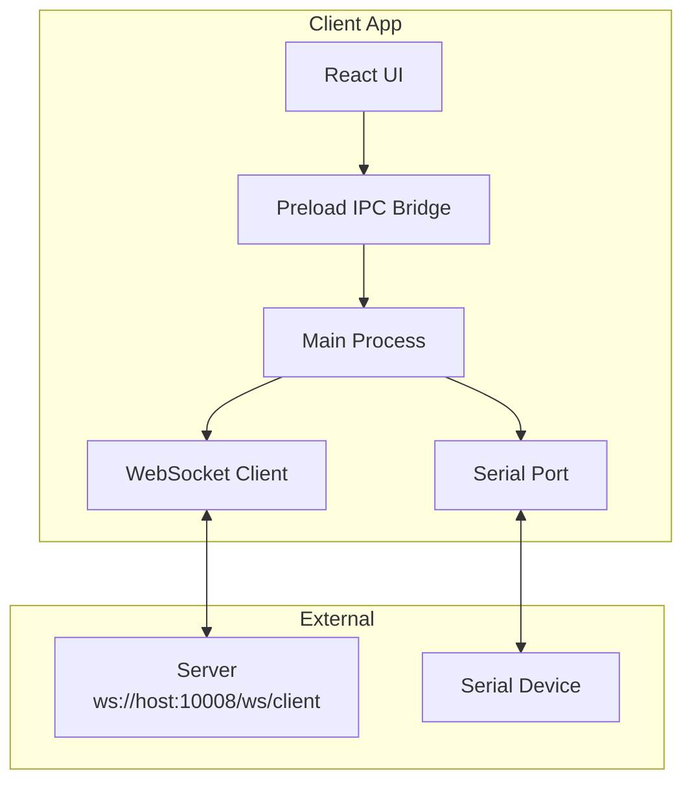
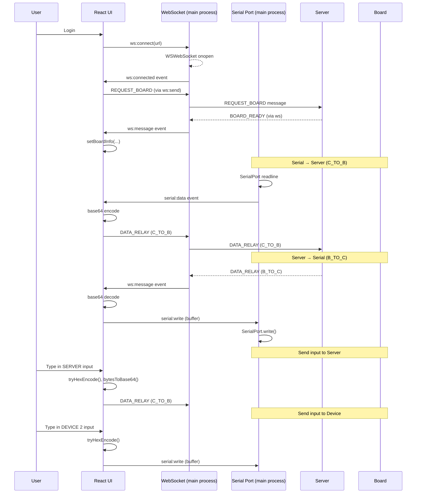

# Client App Design

## Overview

Electron desktop application with React renderer. Connects to the Nexio server via WebSocket and bridges data between the server and a local serial port. Also handles user authentication (login/register) via HTTP REST API.

## Architecture


```mermaid
graph TB
    subgraph "Client App"
        UI[React UI]
        PRE[Preload IPC Bridge]
        MP[Main Process]
        WS[WebSocket Client]
        SER[Serial Port]
    end

    subgraph "External"
        S[Server<br/>ws://host:10008/ws/client]
        D[Serial Device]
    end

    UI --> PRE
    PRE --> MP
    MP --> WS
    MP --> SER
    WS <--> S
    SER <--> D
```

## Process Model

| Process | File | Description |
|---------|------|-------------|
| Main | `main.ts` | Electron main process. Manages WS/SerialPort, IPC handlers, auth HTTP calls |
| Preload | `preload.ts` | `contextBridge.exposeInMainWorld('electronAPI', ...)` — exposes serial/ws/vuart/auth/system/log channels |
| Renderer | `renderer/App.tsx` | React SPA, pipeline UI, state machine, log display |
| Styles | `renderer/index.css` | Dark/light themes, pipeline dots, log colors, auth cards |

### Main Process (`main.ts`)

IPC Handlers (all `ipcMain.handle`):

| Channel | Input | Description |
|---------|-------|-------------|
| `serial:list` | — | Lists all serial ports + vUART devices |
| `serial:open` | `{ path, baudRate }` | Opens SerialPort with ReadlineParser (`\r\n` delimiter) |
| `serial:write` | `number[]` | Writes `Buffer.from(data)` to open serial port |
| `serial:close` | — | Closes serial port |
| `vuart:create` | — | Creates virtual UART pair via socat |
| `vuart:list` | — | Lists all vUART pairs |
| `vuart:delete` | `id` | Deletes a vUART pair |
| `ws:connect` | `url` | Creates `new WSWebSocket(url)`, sets up onopen/onmessage/onclose/onerror |
| `ws:send` | `message` | Calls `ws.send(message)` |
| `ws:close` | — | Closes WebSocket |
| `ws:isConnected` | — | Returns `ws.readyState === OPEN` |
| `auth:login` | `{ username, password, serverUrl }` | HTTP POST `/api/auth/login` |
| `auth:register` | `{ username, password, email, orgName, serverUrl }` | HTTP POST `/api/auth/register` |
| `system:checkSocat` | — | `which socat` |
| `system:getPlatform` | — | `{ platform, arch }` |
| `log:write` | `{ ts, type, msg }` | Appends to session log file |
| `log:open` | — | Opens `app.getPath('userData')/logs/` in Finder |

WebSocket lifecycle:
- `ws:connect` → `new WSWebSocket(url)`, sends `ws:connected`/`ws:message`/`ws:disconnected` events to renderer
- `ws:send` → calls `ws.send()` (guarded by `readyState === OPEN`)
- `ws:close` → calls `ws.close()`

`openDevTools()` is commented out (devtools disabled in production).

### Preload Script (`preload.ts`)

Single `contextBridge.exposeInMainWorld('electronAPI', ...)` with namespaced methods:

| Namespace | Methods | Event listeners |
|-----------|---------|-----------------|
| `serial` | `list`, `open`, `write`, `close` | `onData(cb)` → listener on `serial:data` |
| `vuart` | `create`, `list`, `delete` | — |
| `ws` | `connect`, `send`, `close`, `isConnected` | `onConnected`, `onDisconnected`, `onMessage` |
| `auth` | `login`, `register` | — |
| `system` | `checkSocat`, `getPlatform` | — |
| `log` | `write`, `open` | — |

### Renderer (`App.tsx`)

#### State

| State | Type | Ref | Description |
|-------|------|-----|-------------|
| `auth` | `AuthInfo \| null` | `authRef` | Logged-in user info (userId, username, email, orgName, token) |
| `serverStatus` | `'disconnected' \| 'connecting' \| 'connected' \| 'failed'` | `serverStatusRef` | WebSocket connection state |
| `boardInfo` | `{ boardId, sessionId, expiresAt, productConnected? } \| null` | `boardInfoRef` | Assigned board/session |
| `boardDisconnectReason` | `string \| null` | — | Reason for last board disconnect |
| `deviceStatus` | `'disconnected' \| 'connecting' \| 'connected'` | `deviceStatusRef` | Serial port state |
| `availablePorts` | `{ path, manufacturer }[]` | — | Detected serial ports |
| `settings` | `Settings` | — | Server URL, baud rate, serial port path, theme |
| `hexMode` | `boolean` | — | HEX input toggle |
| `logs` | `LogEntry[]` | — | Max 50000 entries |

#### Auth Flow

1. On mount: `loadAuth()` from `localStorage['nexio_auth']`, `loadSettings()` from `localStorage['nexio_settings']`
2. If not authenticated → auth screen (login/register tabs)
3. `handleLogin`/`handleRegister` → `http://host:port/api/auth/login` or `/api/auth/register` → save token to localStorage
4. On auth success: `setupListeners()`, `checkEnvironment()`, `autoConnectWs()`
5. `handleLogout`: clear localStorage, `stopReconnectTimer()`, `stopBoardRetry()`, close WS/serial, reset all state

#### WebSocket Listeners (set up once on auth)

| Event | Action |
|-------|--------|
| `onConnected` | `setServerStatus('connected')`, `stopReconnectTimer()`, `boardRequestedRef = false`, `requestBoard()` |
| `onDisconnected` | `setServerStatus('disconnected')`, save disconnect reason, `setBoardInfo(null)`, `startReconnectTimer()` |
| `onMessage` | `handleWsMessage()` |

#### `handleWsMessage(message: string)`

| `msg.type` | Action |
|-----------|--------|
| `BOARD_READY` | `setBoardInfo({ boardId, sessionId, expiresAt, productConnected })`, clear disconnect reason. If device connected, send `CLIENT_READY` |
| `CONTROL` (action=DISCONNECT/SESSION_TERMINATED) | `setBoardInfo(null)`, set reason, `boardRequestedRef = false` |
| `END_SESSION` | `setBoardInfo(null)`, set reason, `boardRequestedRef = false` |
| `AUTH_INFO` | Log auth confirmation |
| `DATA_RELAY` (direction=B_TO_C) | Decode base64 → write to serial (if device connected), log |
| `ERROR` (code=BOARD_NOT_FOUND/SESSION_EXPIRED) | `setBoardInfo(null)`, `boardRequestedRef = false`, log |

#### Board Request Retry (interval-based)

- `startBoardRetry()`: 5s interval, calls `requestBoard()` only if `!boardRequestedRef.current && authRef.current`
- `stopBoardRetry()`: clears interval
- React effect `[serverStatus, boardInfo]`: starts retry when `serverStatus === 'connected' && !boardInfo`, stops otherwise
- Cleanup on effect teardown: `stopBoardRetry()`

#### Auto Reconnect Timer

- `startReconnectTimer()`: 5s interval, calls `ws.connect(settings.serverUrl)`
- `stopReconnectTimer()`: clears interval
- Started on WS disconnect, stopped on WS connected
- Both timers stopped in `handleLogout()`

#### Auto-connect (initial)

- `autoConnectWs()`: 3 attempts with 1s delay between each. Sets `connecting` → `connected` or `failed`

#### Data Flow


```mermaid
sequenceDiagram
    participant User
    participant UI as React UI
    participant WS as WebSocket (main process)
    participant SER as Serial Port (main process)
    participant SVR as Server
    participant B as Board

    User->>UI: Login
    UI->>WS: ws:connect(url)
    WS-->>WS: WSWebSocket onopen
    WS->>UI: ws:connected event
    UI->>WS: REQUEST_BOARD (via ws:send)
    WS->>SVR: REQUEST_BOARD message
    SVR-->>WS: BOARD_READY (via ws)
    WS->>UI: ws:message event
    UI->>UI: setBoardInfo(...)

    Note over SER,B: Serial → Server (C_TO_B)
    SER->>SER: SerialPort readline
    SER->>UI: serial:data event
    UI->>UI: base64 encode
    UI->>WS: DATA_RELAY (C_TO_B)
    WS->>SVR: DATA_RELAY (C_TO_B)

    Note over B,SER: Server → Serial (B_TO_C)
    SVR-->>WS: DATA_RELAY (B_TO_C)
    WS->>UI: ws:message event
    UI->>UI: base64 decode
    UI->>SER: serial:write (buffer)
    SER->>SER: SerialPort.write()

    Note over B,SER: Send input to Server
    User->>UI: Type in SERVER input
    UI->>UI: tryHexEncode(), bytesToBase64()
    UI->>WS: DATA_RELAY (C_TO_B)

    Note over B,SER: Send input to Device
    User->>UI: Type in DEVICE 2 input
    UI->>UI: tryHexEncode()
    UI->>SER: serial:write (buffer)
```

#### Pipeline UI

```
┌──── SERVER ────┐     ┌──── MODULE ────┐     ┌──── DEVICE 1 ────┐
│  ● connected   │─────│  ● BOARD-0001  │─────│  ●/○ Not connected│
└────────────────┘     └────────────────┘     └───────────────────┘
┌──── CLIENT ────┐     ┌──── DEVICE 2 ────┐
│  ●             │─────│  ● /dev/cu.usb...│
└────────────────┘     └──────────────────┘
```

Pipeline nodes:
- **SERVER**: dot on when `serverStatus === 'connected'`. Shows "Retry" button when `failed`
- **MODULE**: dot on when `boardInfo !== null`. Shows boardId tag or reason/waiting tag
- **DEVICE 1**: dot on when `boardInfo?.productConnected === true`. Shows "Not connected" tag when board assigned but product disconnected. Shows disconnect reason when no board
- **CLIENT**: dot always on
- **DEVICE 2**: dot on when `deviceStatus === 'connected'`. Shows serial port path tag

Pipeline CSS: `.pipeline-line { flex: 0 0 36px }` — fixed width regardless of content.

#### Dot states

| Class | Color | When |
|-------|-------|------|
| `.pipeline-dot.on` | Green + glow | Connected/active |
| `.pipeline-dot.off` | Red + glow | Disconnected/offline (also default for `!boardInfo`) |
| `.pipeline-dot` (no class) | Gray (CSS default `--border-strong`) | Neutral/unset |

#### Tag variants

| Class | Display |
|-------|---------|
| `.pipeline-tag` | Blue text on subtle bg (board ID) |
| `.pipeline-tag.reason` | Red text on red-tinted bg (disconnect reason, "Not connected") |
| `.pipeline-tag.wait` | Gray, shown when no board and no reason but server connected |

#### Serial Port (DEVICE 2)

- Dropdown: all ports excluding those with `manufacturer.startsWith('vUART:')`
- Baudrate: 9600–921600, stored in localStorage
- `connectSerial()`: opens port, sends `CLIENT_READY` if server+board ready
- `disconnectSerial()`: closes port
- Serial data received: base64-encode and relay to server via `DATA_RELAY`

## Send Input

Two input rows: SERVER (C→B) and DEVICE 2 (serial output).

- HEX toggle: when active, input is hex-decoded before sending. Invalid hex shows error.
- Text mode (default): `strToBytes()` — each char→byte, appends `0x0a` (newline)
- HEX mode: regex `/^[0-9a-fA-F]*$/`, parse pairs, appends `0x0a`

## Log Panel

- Types: `info`, `tx_server`, `tx_device`, `rx_server`, `rx_device`, `error`
- Color-coded: green (→SV), blue (→DV), purple (←SV), orange (←DV), red (error), gray (info)
- Actions: CLEAR, OPEN LOG (opens Finder)

## Data Encoding

| Direction | From | To | Method |
|-----------|------|----|--------|
| Serial → Server | UTF-8 string | Base64 | `bytesToBase64()` via `btoa()` |
| Server → Serial | Base64 | `number[]` | `base64ToBytes()` via `atob()` |

## Settings

- Stored in `localStorage['nexio_settings']` as JSON
- Fields: `serverUrl`, `baudRate`, `serialPortPath`, `theme`
- Modal UI in settings button (top-right ⛭)
- Save triggers `reconnectWs()` (close + reconnect with new URL)

## Error Handling

| Error | Action |
|-------|--------|
| WebSocket disconnect (server) | `setServerStatus('disconnected')`, start 5s reconnect timer |
| Board not found (server reply) | `boardRequestedRef = false`, auto-retry in 5s |
| Session expired | `setBoardInfo(null)`, `boardRequestedRef = false`, auto-retry |
| Board disconnected (server END_SESSION) | `setBoardInfo(null)`, show reason, auto-retry |
| Serial port error | Show in log, `setDeviceStatus('disconnected')` |
| Login/register failure | Show error in auth form |

## Key Files

| File | Lines | Contents |
|------|-------|----------|
| `src/main.ts` | ~293 | Electron main process — WS, SerialPort, IPC, auth HTTP |
| `src/preload.ts` | ~48 | contextBridge IPC exposure |
| `src/renderer/App.tsx` | ~681 | React SPA — UI, state machine, WS message handling |
| `src/renderer/index.css` | ~283 | Dark/light themes, pipeline, log, auth, modal styles |
