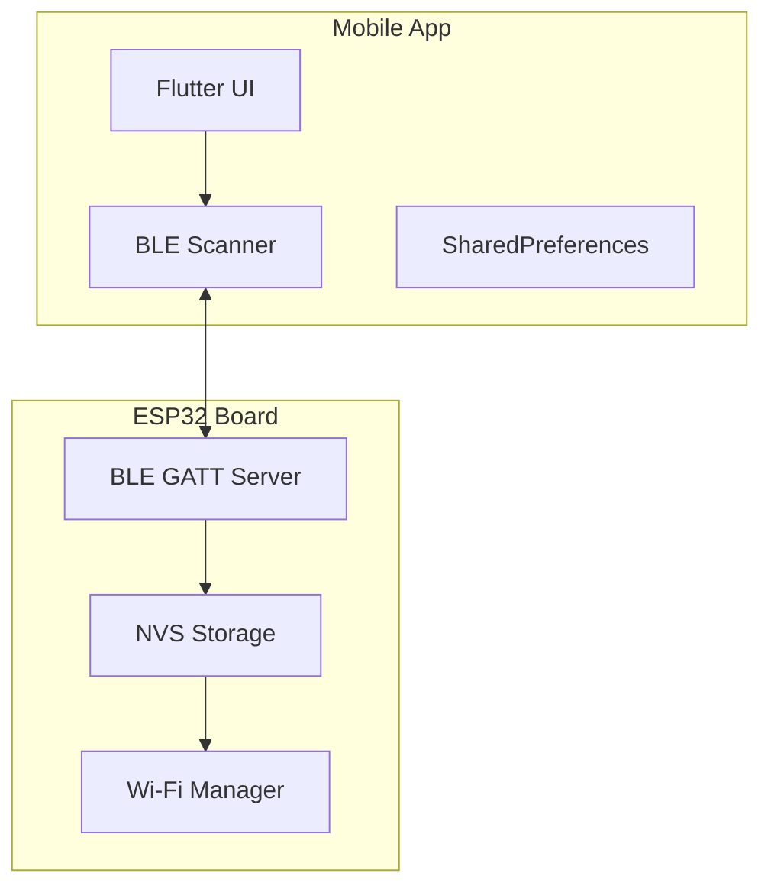
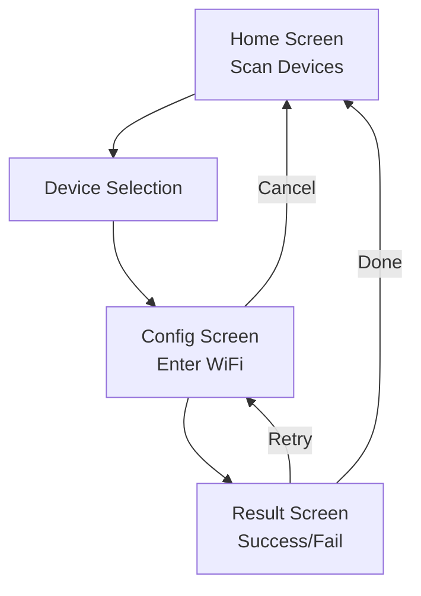
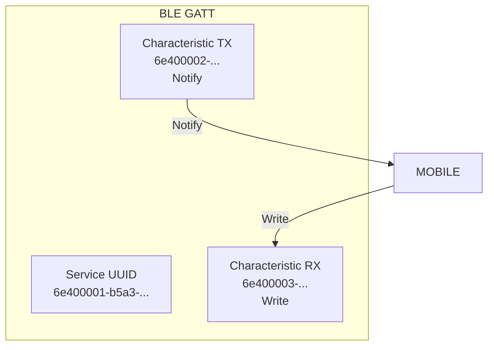
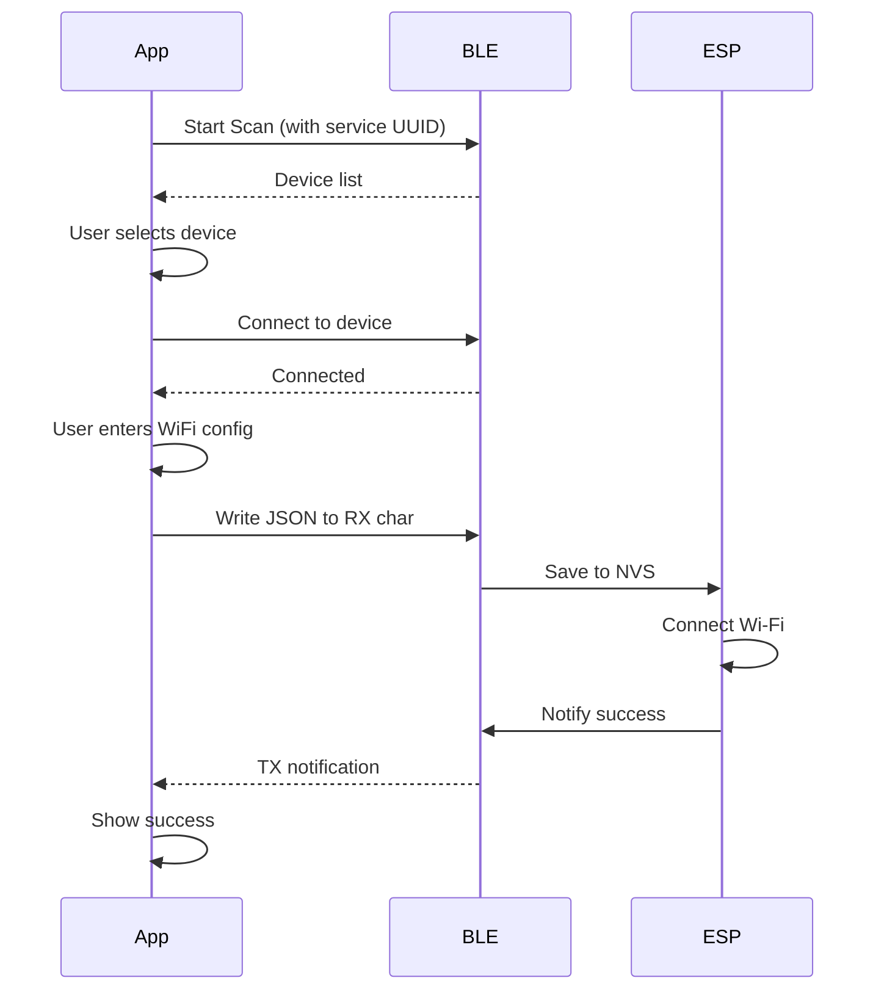

# Mobile App Design

## Overview

Flutter mobile application for BLE-based ESP32 onboarding. Scans for Nexio ESP32 devices via BLE and sends WiFi configuration.

## Architecture



## Screens



### Screen 1: Home (Device Scan)

```
┌────────────────────────────┐
│ ← Nexio Setup              │
├────────────────────────────┤
│                            │
│ 🔍 Scanning for devices...│
│                            │
│ ┌────────────────────────┐ │
│ │ 🔵 Nexio-ESP32          │
│ │    AA:BB:CC:DD:EE:FF   │ │
│ └────────────────────────┘ │
│                            │
│ Saved Server:              │
│ ws://192.168.1.100:10008    │
│                            │
│    [Refresh]               │
└────────────────────────────┘
```

### Screen 2: Configuration

```
┌────────────────────────────┐
│ ← Configure WiFi          │
├────────────────────────────┤
│                            │
│ Device: Nexio-ESP32        │
│ MAC: AA:BB:CC:DD:EE:FF     │
│                            │
│ ┌────────────────────────┐ │
│ │ WiFi SSID               │ │
│ │ [MyWiFi           ]     │ │
│ └────────────────────────┘ │
│                            │
│ ┌────────────────────────┐ │
│ │ WiFi Password          │ │
│ │ [********         ]    │ │
│ └────────────────────────┘ │
│                            │
│ ┌────────────────────────┐ │
│ │ Server URL             │ │
│ │ [ws://192.168.1.100    │ │
│ │     :10008/ws/board]   │ │
│ └────────────────────────┘ │
│                            │
│ ┌────────────────────────┐ │
│ │ 🔗 Sending...         │ │
│ └────────────────────────┘ │
└────────────────────────────┘
```

### Screen 3: Result

```
┌────────────────────────────┐
│ ← Result                   │
├────────────────────────────┤
│                            │
│      ✓ Success!            │
│                            │
│ Configuration sent.        │
│ ESP32 will connect to       │
│ your WiFi network.        │
│                            │
│ ┌────────────────────────┐ │
│ │     Done              │ │
│ └────────────────────────┘ │
└────────────────────────────┘
```

## BLE Service Specification



**Service UUID:** `6e400001-b5a3-f393-e0a9-e50e24dcca9e`

**Characteristics:**
| UUID | Name | Properties |
|------|------|------------|
| 6e400002-... | TX | Notify |
| 6e400003-... | RX | Write |

## Configuration Data Format

### Write to BLE RX Characteristic

```json
{
  "ssid": "MyWiFiNetwork",
  "password": "password123",
  "serverUrl": "ws://192.168.1.100:10008/ws/board"
}
```

## Flow Diagram



## Key Features

1. **BLE Scanning**
   - Scan for devices with Nexio service UUID
   - Display device name and MAC address

2. **BLE Connection**
   - Connect to selected ESP32 device
   - Discover services and characteristics

3. **Configuration Input**
   - WiFi SSID input
   - WiFi password input
   - Server URL input (editable)

4. **Data Transmission**
   - Write JSON configuration to BLE
   - Receive success/failure notification

5. **Settings Persistence**
   - Save server URL locally
   - Auto-fill on next launch

## Error Handling

| Error | Action |
|-------|--------|
| BLE not available | Show error message |
| Device not found | Show "No devices found" |
| Connection failed | Show error, retry option |
| Write failed | Show error, retry option |
| Timeout | Show timeout message |