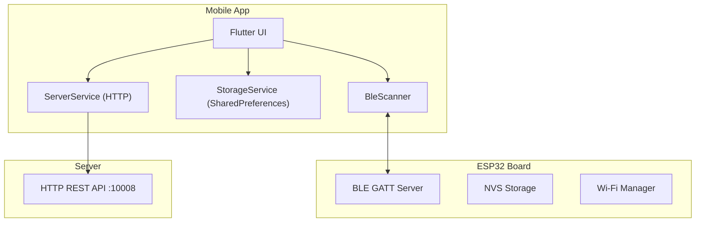
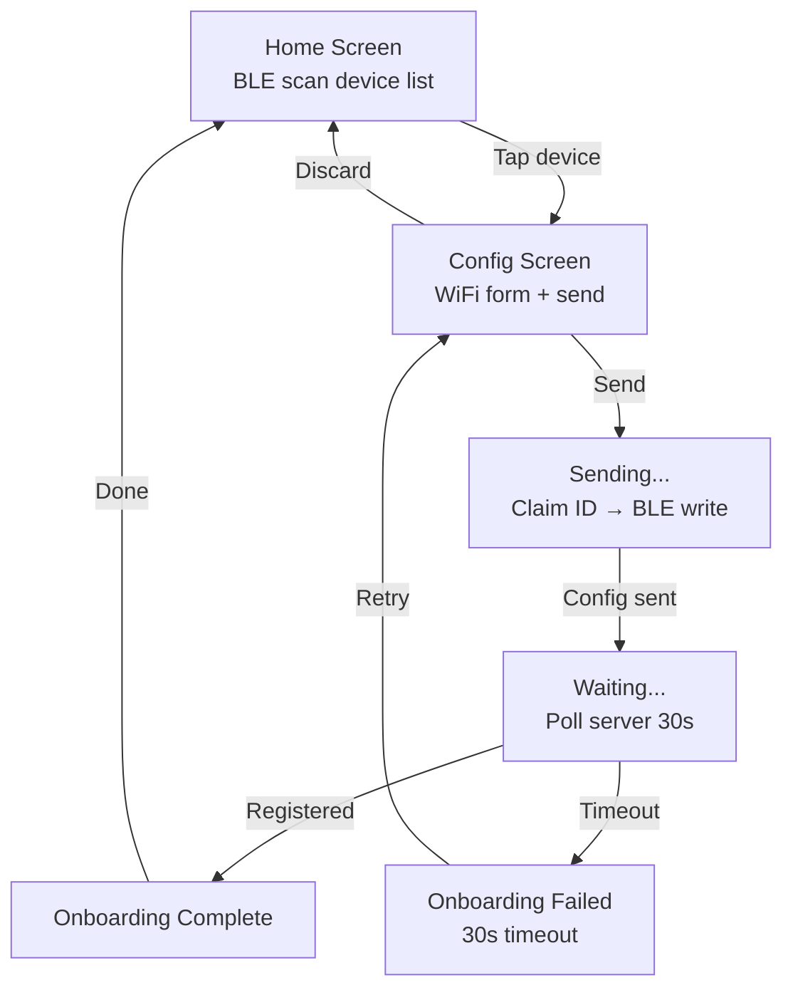

# Mobile App Design

## Overview

Flutter mobile application for BLE-based ESP32 onboarding. Scans for Nexio devices, connects via BLE, sends WiFi configuration + server URL, then polls the server to confirm registration.

## Architecture


```mermaid
graph TB
    subgraph "Mobile App"
        BLE[BleScanner]
        UI[Flutter UI]
        STORAGE["StorageService (SharedPreferences)"]
        SERVER["ServerService (HTTP)"]
    end

    subgraph "ESP32 Board"
        BLE_ESP["BLE GATT Server"]
        NVS["NVS Storage"]
        WIFI["Wi-Fi Manager"]
    end

    subgraph "Server"
        API["HTTP REST API :10008"]
    end

    UI --> BLE
    BLE <--> BLE_ESP
    UI --> STORAGE
    UI --> SERVER
    SERVER --> API
```

## Screens & Flow


```mermaid
graph TD
    HOME["Home Screen<br/>BLE scan device list"] -->|Tap device| CONFIG["Config Screen<br/>WiFi form + send"]
    CONFIG -->|Send| SENDING["Sending...<br/>Claim ID → BLE write"]
    SENDING -->|Config sent| WAITING["Waiting...<br/>Poll server 30s"]
    WAITING -->|Registered| DONE["Onboarding Complete"]
    WAITING -->|Timeout| FAILED["Onboarding Failed<br/>30s timeout"]
    FAILED -->|Retry| CONFIG
    CONFIG -->|Discard| HOME
    DONE -->|Done| HOME
```

## StorageService (`storage_service.dart`)

SharedPreferences with `Map<SSID, password>` JSON serialization.

| Key | Value |
|-----|-------|
| `server_url` | Server HTTP URL string |
| `wifi_profiles` | JSON `{"ssid": "password", ...}` |
| `last_wifi_ssid` | Last used SSID |

Methods: `getServerUrl`, `setServerUrl`, `clearServerUrl`, `getWifiProfiles`, `saveWifiProfile`, `deleteWifiProfile`, `getLastWifiSsid`.

### SSID/Password Default

When no saved profiles exist:
- SSID: `"hyunu_2.4Ghz"`
- Password: `"gusdn1006"`

### `getWifiProfiles()` Defense

If stored JSON fails to decode or is not a `Map`, the key is removed and empty map returned.

---

## Home Screen (`home_screen.dart`)

### BLE Scan

- Uses `FlutterBluePlus` (v1.x API)
- Scan filter: device name starts with `"Nexio"` OR manufacturer data contains company ID `0x02D5` OR service UUID contains `6e400001`
- 10-second scan timeout
- Results streamed via `BleScanner.scanResults` (broadcast `StreamController`)

### Device State Parsing

From Manufacturer Data byte[2] (flags):

| Bit | Flag | State enum |
|-----|------|-----------|
| 0 | `PRD` | Product connected |
| 1 | `SVR` | Registered with server |
| 2 | `WIFI` | WiFi connected |
| 3 | `CFG` | Configured (NVS has settings) |

States derived:
| Flags | Enum State | Color |
|-------|-----------|-------|
| none | `unconfigured` | Blue Grey |
| CFG only | `configuring` | Amber |
| CFG+WIFI | `connecting` | Orange |
| CFG+WIFI+SVR | `connected` | Blue |
| All 4 | `fullConnected` | Green |
| CFG+WIFI (no SVR) | `wifiOnly` | Red |

### UI Components

- **Device card**: Icon (colored by state), device name, MAC address, RSSI bars (0-4 bars), state label chip
- **Server settings**: Settings icon in AppBar → AlertDialog with monospace URL input → saves to StorageService
- Default server URL: `http://192.168.0.142:10008`

### Navigation

`_onDeviceSelected` → push `ConfigScreen(device, serverUrl)`. On return → rescan.

---

## Config Screen (`config_screen.dart`)

### Stages (`OnboardingStage`)

| Stage | Form fields enabled | Description |
|-------|-------------------|-------------|
| `form` | Yes | WiFi SSID/password input, profile selector, send button |
| `sending` | No | Claiming ID from server + writing config via BLE |
| `waiting` | No | Waiting for board to register (polling server) |
| `completed` | No | Success — Done button |
| `failed` | No | Failure — Close/Retry |

### WiFi Profile Selector

- `Wrap` of chips showing saved SSIDs
- Active chip: primary color border + bold text
- Delete button (X) per chip → confirmation dialog → `_deleteProfile()`
- Tap chip → fill SSID + password fields
- On successful config send → `_storageService.saveWifiProfile()`

### Send Flow

1. `_sendConfig()` called
2. **Claim**: `ServerService.claimUniqueId(macAddress)` → POST `/api/onboarding/claim` → get `uniqueId`
3. **BLE Write**: `_bleScanner.sendConfig(device, { ssid, password, serverUrl, uniqueId })` → write JSON to RX characteristic
4. **Save profile**: `_storageService.saveWifiProfile(ssid, password)`
5. **Poll**: `ServerService.waitForOnboarding(macAddress)` → GET `/api/boards/onboarding?mac=` every 3s, timeout 30s
6. **Result**: `completed` or `failed`

### BLE Log Subscription

- `BleScanner.subscribeToLogs(device)` → subscribe to TX characteristic notify
- Log level: `error` if message contains FAILED/Error/timeout/retrying/not found/Wrong password
- Displayed in `_buildBleLogPanel` — timestamped, color-coded (green/red)
- Only shown during `sending` and `waiting` stages
- NOT shown during `failed` stage (error messages appear in status card instead)

### Device Controls (bottom sheet in form stage)

| Button | BLE Command | Server Action |
|--------|------------|--------------|
| **Reset** | `{"action":"RESET"}` | None (board restarts) |
| **Discard** | `{"action":"DISCARD"}` | After 300ms delay: POST `/api/boards/discard-by-mac`, disconnect BLE, pop back to home |

Both buttons disabled when not connected or currently sending.

---

## ServerService (`server_service.dart`)

HTTP client (dart:io `HttpClient`, 5s connection timeout).

| Method | Endpoint | Retry |
|--------|----------|-------|
| `claimUniqueId(mac)` | POST `/api/onboarding/claim` | No |
| `checkOnboarding(mac)` | GET `/api/boards/onboarding?mac=` | No |
| `discardByMac(mac)` | POST `/api/boards/discard-by-mac` | No |
| `waitForOnboarding(mac, interval=3s, timeout=30s)` | Polls `checkOnboarding` | 3s interval, 30s max |

URL conversion: `ws://host:port/path` → `http://host:port` (removes ws prefix and path suffix).

---

## BleScanner (`ble_scanner.dart`)

### GATT UUIDs

| UUID | Role | BLE Property |
|------|------|-------------|
| `6e400001-b5a3-f393-e0a9-e50e24dcca9e` | Service | — |
| `6e400002-b5a3-f393-e0a9-e50e24dcca9e` | TX (board → phone) | Notify |
| `6e400003-b5a3-f393-e0a9-e50e24dcca9e` | RX (phone → board) | Write |

### Methods

| Method | Description |
|--------|-------------|
| `startScan(timeout)` | `FlutterBluePlus.startScan()`, subscribe to `scanResults` |
| `stopScan()` | Unsubscribe + `FlutterBluePlus.stopScan()` |
| `discoverServices(device)` | Cached service discovery (single-flight) |
| `clearCache()` | Reset service cache |
| `subscribeToLogs(device)` | Set TX notify → stream of log strings |
| `sendConfig(device, config)` | Write JSON to RX characteristic |
| `sendCommand(device, action)` | Write `{"action":"..."}` to RX characteristic |
| `parseStateFromAdData(data)` | Decode manufacturer data flags → `NexioDeviceState` |

### Config JSON Format

```json
{"ssid":"MyWiFi","password":"secret","serverUrl":"http://host:10008","uniqueId":"0042"}
```

- `uniqueId` only included when non-empty
- Proper JSON escaping for special characters

---

## Error Handling

| Error | Action |
|-------|--------|
| BLE not available | Scan fails gracefully |
| Device connection timeout (10s) | Show "Connection failed" |
| Server claim fails | Show error, return to form |
| BLE write fails | Show "Failed to send" |
| Board registration timeout (30s) | Show failure with message to check WiFi |
| Invalid stored data | Delete corrupted key, return default |
| `_bleScanner.sendCommand()` exception | Catch silently (board may restart mid-write) |

## Key Files

| File | Lines | Contents |
|------|-------|----------|
| `lib/main.dart` | — | App entry, MaterialApp |
| `lib/screens/home_screen.dart` | ~463 | BLE scan, device list, state badges |
| `lib/screens/config_screen.dart` | ~914 | WiFi form, profile selector, BLE config send, polling, controls |
| `lib/ble/ble_scanner.dart` | ~184 | BLE scan, GATT discover/read/write/subscribe |
| `lib/services/storage_service.dart` | ~61 | SharedPreferences: server URL, WiFi profiles |
| `lib/services/server_service.dart` | ~86 | HTTP: claim, polling, discard |
