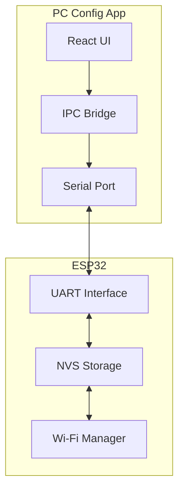
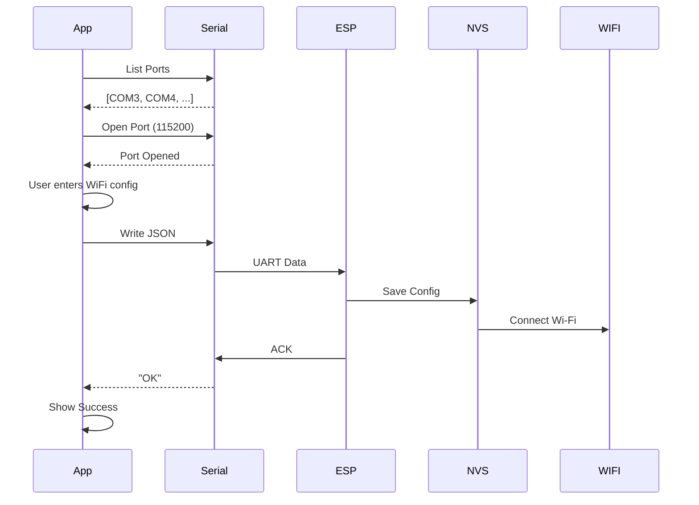

# PC Config App Design

## Overview

Electron desktop application for configuring ESP32 via serial port. Alternative to BLE mobile app for users without smart devices.

## Architecture



## Data Flow



## UI Layout

```
┌─────────────────────────────────────────────────┐
│            Nexio PC Config                      │
│         ESP32 WiFi Configuration               │
├─────────────────────────────────────────────────┤
│                                                 │
│  ┌─ Serial Connection ────────────────────────┐ │
│  │ Port: [COM3 ▼]  Baud: [115200 ▼]          │ │
│  │ [Connect] ● Connected                      │ │
│  │ [Refresh]                                  │ │
│  └───────────────────────────────────────────┘ │
│                                                 │
│  ┌─ WiFi Configuration ─────────────────────┐ │
│  │                                           │ │
│  │ WiFi SSID                                  │ │
│  │ [________________________]                  │ │
│  │                                           │ │
│  │ WiFi Password                              │ │
│  │ [________________________]                │ │
│  │                                           │ │
│  │ Server URL                                │ │
│  │ [ws://192.168.1.100:10008/ws/board___]    │ │
│  │                                           │ │
│  │          [Send Configuration]            │ │
│  └───────────────────────────────────────────┘ │
│                                                 │
│  ┌─ Log ────────────────────────────────────┐ │
│  │ [12:00:00] Connected to COM3              │ │
│  │ [12:00:01] Configuration sent!            │ │
│  │ [12:00:02] ESP32 will restart...          │ │
│  └───────────────────────────────────────────┘ │
└─────────────────────────────────────────────────┘
```

## Serial Protocol

### Command Format

```json
{
  "ssid": "MyWiFiNetwork",
  "password": "password123",
  "serverUrl": "ws://192.168.1.100:10008/ws/board"
}
```

### Response Format

```
OK
```
```
ERROR: invalid format
```

## Serial Port Settings

| Setting | Value |
|---------|-------|
| Baud Rate | 115200 |
| Data Bits | 8 |
| Parity | None |
| Stop Bits | 1 |
| Flow Control | None |

## Features

1. **Serial Port Discovery**
   - List available COM ports
   - Display port info (manufacturer)

2. **Serial Connection**
   - Open port with selected baud rate
   - Close port

3. **Configuration**
   - WiFi SSID input
   - WiFi password input
   - Server URL input

4. **Data Transmission**
   - Send JSON to ESP32
   - Receive ACK

5. **Logging**
   - Real-time log display
   - Timestamps
   - Color-coded (sent/received/errors)

## Error Handling

| Error | Action |
|-------|--------|
| Port not found | Show error message |
| Port open failed | Show error message |
| Write failed | Show error message |
| No response | Show timeout message |

## Use Cases

1. **Initial Setup**
   - Connect ESP32 via USB
   - Send WiFi credentials
   - ESP32 connects to WiFi

2. **Configuration Change**
   - Change WiFi network
   - Update server URL
   - Reset configuration