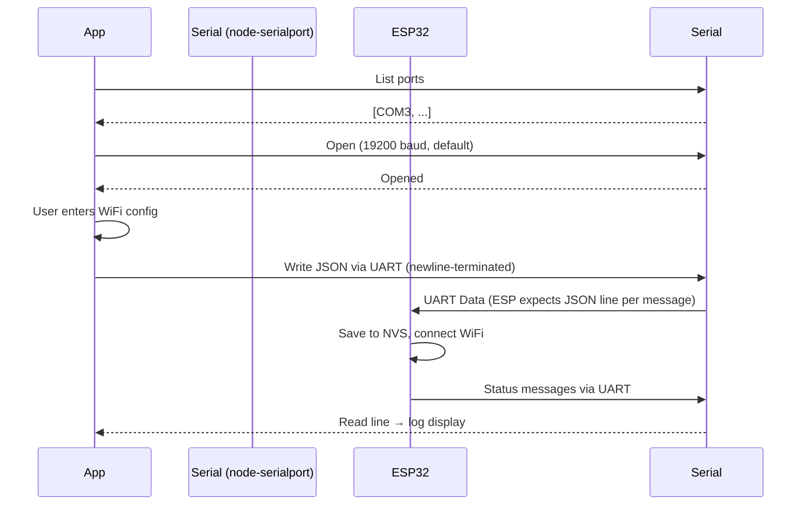

# PC Config App Design

## Overview

Electron desktop application for configuring ESP32 via serial port. Alternative to BLE mobile onboarding for users without smart devices. Sends WiFi credentials and server URL over UART.

## Architecture

```
React UI ⇄ IPC Bridge (preload/main) ⇄ SerialPort (node-serialport) ⇄ ESP32 UART (GPIO 20/21)
```

## Data Flow


```mermaid
sequenceDiagram
    participant App
    participant Serial (node-serialport)
    participant ESP32

    App->>Serial: List ports
    Serial-->>App: [COM3, ...]

    App->>Serial: Open (19200 baud, default)
    Serial-->>App: Opened

    App->>App: User enters WiFi config
App->>Serial: Write JSON via UART (newline-terminated)
Serial->>ESP32: UART Data (ESP expects JSON line per message)

    ESP32->>ESP32: Save to NVS, connect WiFi
    ESP32->>Serial: Status messages via UART
    Serial-->>App: Read line → log display
```

## UI Layout

```
┌──────────────────────────────────────────────┐
│         Nexio PC Config                      │
│      ESP32 WiFi Configuration                │
├──────────────────────────────────────────────┤
│                                              │
│  ┌─ Serial Connection ─────────────────────┐ │
  │  │ Port: [COM3 ▼]  Baud: [19200 ▼]       │ │
│  │ [Connect] ● Connected                   │ │
│  │ [Refresh]                               │ │
│  └─────────────────────────────────────────┘ │
│                                              │
│  ┌─ WiFi Configuration ───────────────────┐ │
│  │ WiFi SSID: [______________________]     │ │
│  │ WiFi Password: [________________]      │ │
│  │ Server URL: [ws://host:10008/ws/board] │ │
│  │ Product UART Baud: [19200 ▼]          │ │
│  │        [Send Configuration]            │ │
│  └─────────────────────────────────────────┘ │
│                                              │
│  ┌─ Log ─────────────────────────────────┐  │
│  │ [12:00:00] Connected to COM3          │  │
│  │ [12:00:01] Sent: {"ssid":"...",...}   │  │
│  │ [12:00:02] ESP32: [WIFI] Connecting.. │  │
│  └────────────────────────────────────────┘  │
└──────────────────────────────────────────────┘
```

## Configuration JSON Format

Same as BLE mobile app:

```json
{
  "ssid": "MyWiFi",
  "password": "secret123",
  "serverUrl": "ws://192.168.1.100:10008/ws/board",
  "uniqueId": "0042",
  "baudRate": 19200
}
```

## Serial Port Settings

| Setting | Value |
|---------|-------|
| Baud Rate | 19200 (configurable, 기본값) |
| Data Bits | 8 |
| Parity | None |
| Stop Bits | 1 |
| Flow Control | None |

## Features

1. **Serial Port Discovery** — List available COM ports with manufacturer info + vUART devices
2. **Serial Connection** — Open/close port at selectable baud rate
3. **Configuration Input** — SSID, password, server URL fields
4. **Data Transmission** — Write JSON config to ESP32, read status/log messages
5. **Logging** — Real-time log with timestamps, sent/received color coding

## IPC / Main process behavior

The Electron main process (`src/main.ts`) exposes ipc handlers used by the renderer:

| Channel | Args | Returns | Description |
|---------|------|---------|-------------|
| `serial:list` | — | `[{ path, manufacturer }]` | Lists available serial ports (`SerialPort.list()`) |
| `serial:open` | `{ path, baudRate }` | `{ success, error? }` | Opens `SerialPort` and pipes `ReadlineParser({ delimiter: '\n' })` |
| `serial:write` | `string` | `{ success, error? }` | Writes newline-terminated string to serial |
| `serial:close` | — | `{ success }` | Closes port |
| `serial:isOpen` | — | `boolean` | Whether port is open |
| `server:claim` | `{ serverUrl, macAddress }` | `JSON` | POST to `{toHttpUrl(serverUrl)}/api/onboarding/claim` with `{ macAddress }` |
| `server:checkOnboarding` | `{ serverUrl, macAddress }` | `JSON` | GET `{toHttpUrl(serverUrl)}/api/boards/onboarding?mac=...` |

Notes:
- `toHttpUrl(wsUrl)` converts `ws://...` → `http://...` and strips `/ws/board` or `/ws/client` suffix so main can call the REST API.
- HTTP requests use a 5s timeout and return parsed JSON or `{ error }` on failure.
- Serial parser uses `ReadlineParser` with `\n` delimiter; renderer receives `serial:data` events with trimmed lines.

## Onboarding flow (PC)

1. User selects COM port and baud, clicks Connect → `serial:open` called. Parser event `serial:data` forwarded to renderer.
2. User fills SSID/password/server URL and optional MAC, clicks Send Configuration:
   - Renderer calls `server:claim` to obtain `uniqueId` from server.
   - On success, renderer writes JSON config (includes claimed `uniqueId`) via `serial:write` (newline-terminated).
   - Renderer starts polling `server:checkOnboarding` every 3s for up to 30s; on `registered: true` marks onboarding completed.
3. Logs show sent JSON, received serial lines, and server responses.

## Error Handling

| Error | Action |
|-------|--------|
| Port not found | Show error message |
| Port open failed | Show error message |
| Write failed | Show error message |
| No response | Show timeout message |

## Key Files

| File | Contents |
|------|----------|
| `src/main.ts` | Electron main process, SerialPort IPC |
| `src/preload.ts` | contextBridge for serial operations (exposes `serial.*` and `server.*`) |
| `src/renderer/App.tsx` | React UI — port selector, config form, log, onboarding state machine |
