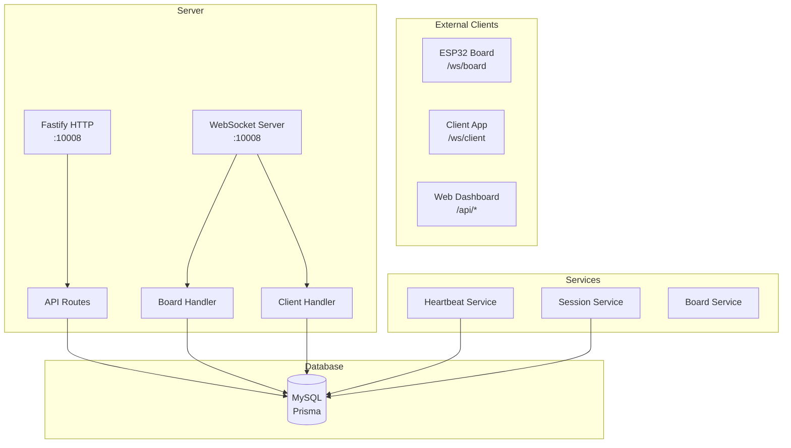
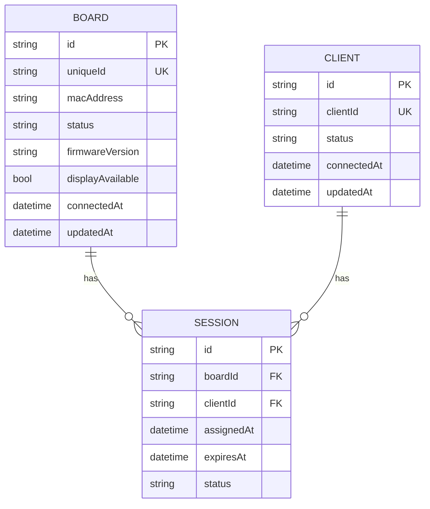
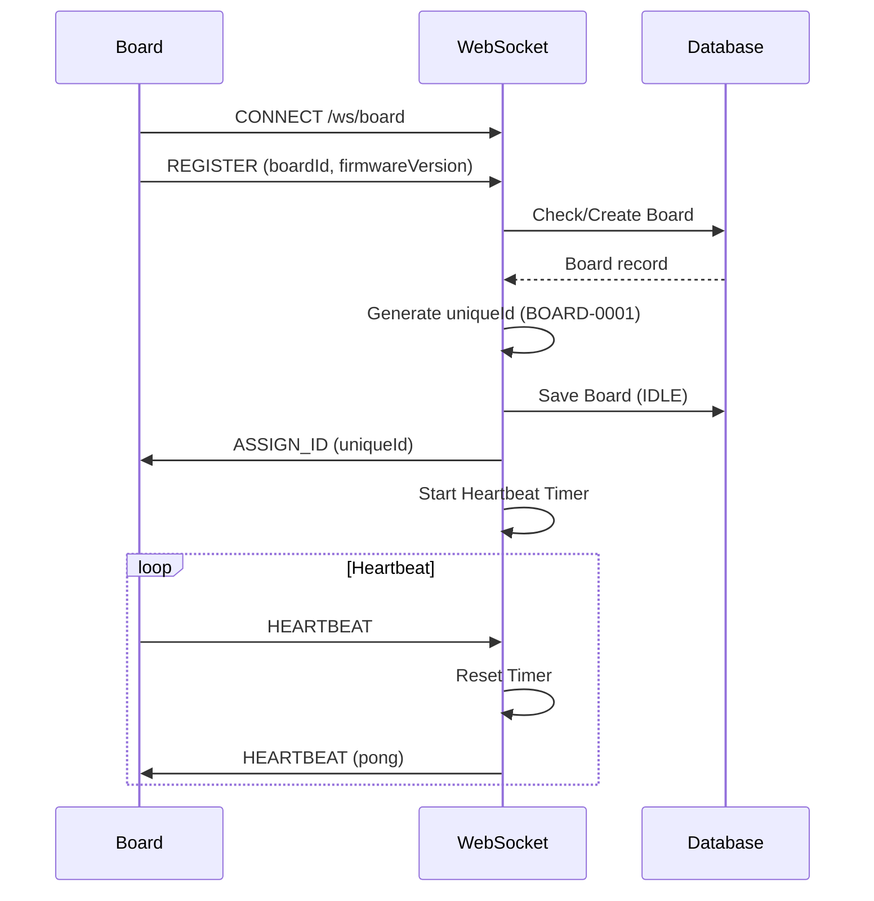
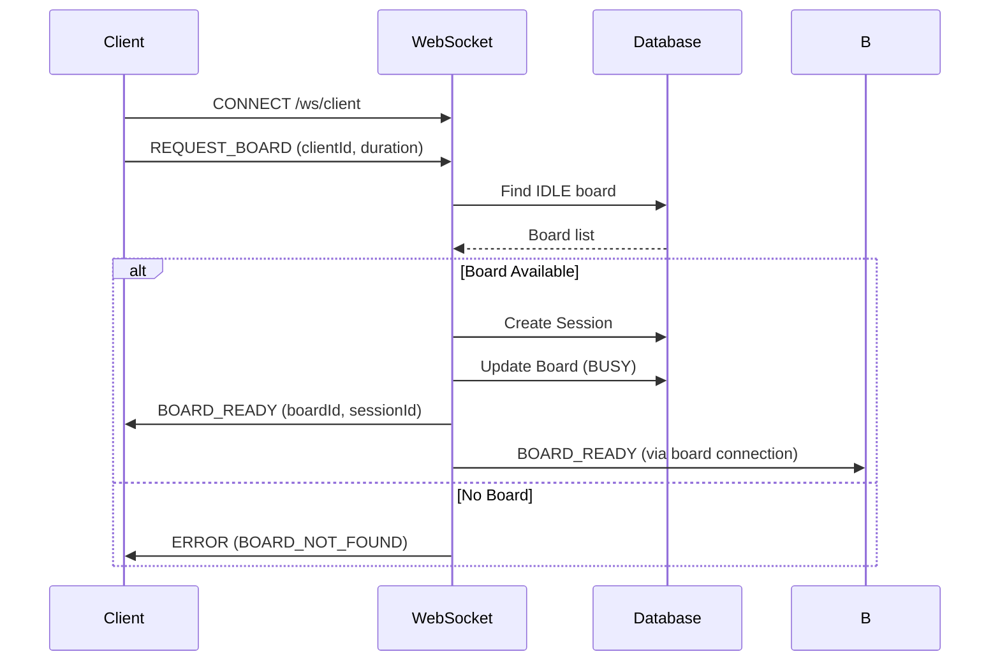
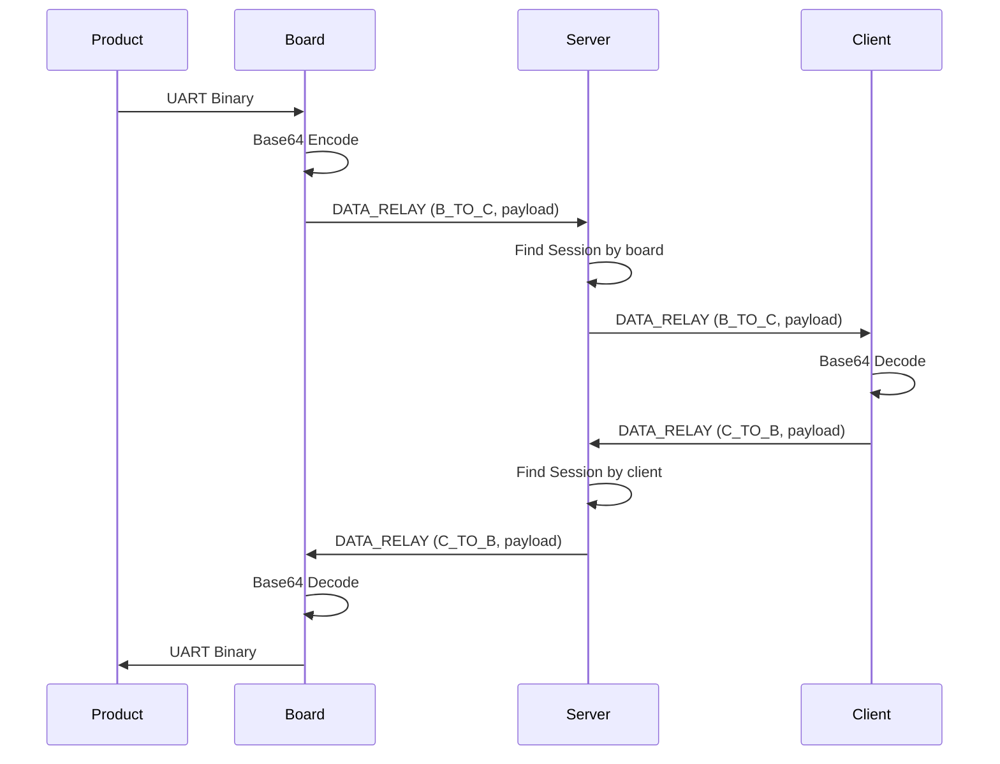
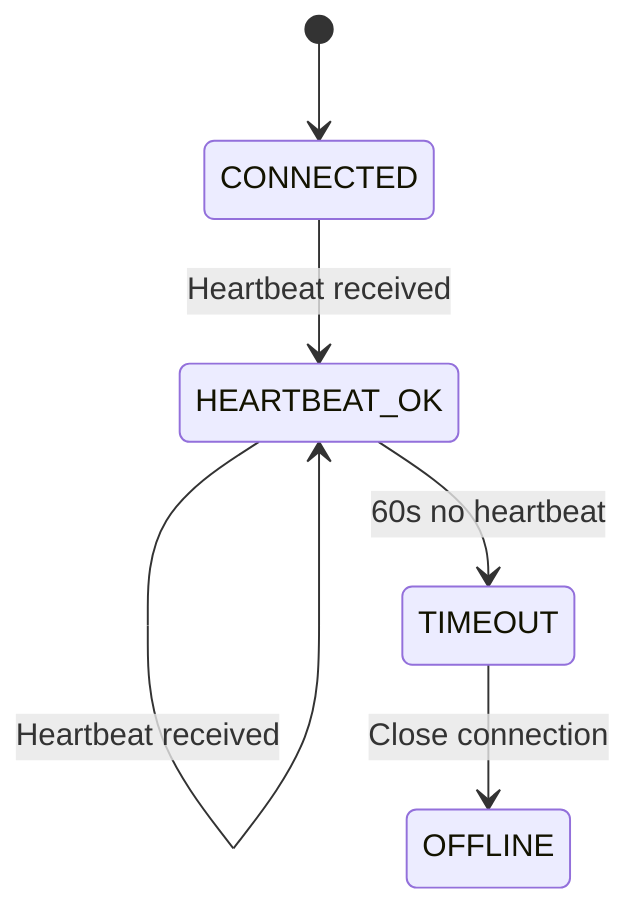

# Server Design

## Overview

Node.js server with Fastify for HTTP API and WebSocket for real-time communication. Handles board registration, session management, and data relay.

## Architecture



## WebSocket Endpoints

```
/ws/board    - ESP32 boards connect here
/ws/client   - Client apps connect here
```

## Database Schema



## Board Connection Flow



## Client Connection Flow



## Data Relay Flow



## API Endpoints

| Method | Path | Description |
|--------|------|-------------|
| GET | `/api/health` | Health check |
| GET | `/api/boards` | List all boards |
| GET | `/api/boards/idle` | List idle boards |
| GET | `/api/clients` | List all clients |
| POST | `/api/sessions` | Create session |
| DELETE | `/api/sessions/:id` | Delete session |
| POST | `/api/control` | Send control command |

## Message Types

### Board → Server

```json
{
  "type": "REGISTER",
  "boardId": "AA:BB:CC:DD:EE:FF",
  "firmwareVersion": "1.0.0",
  "displayAvailable": true
}
```

```json
{
  "type": "HEARTBEAT",
  "id": "BOARD-0001"
}
```

```json
{
  "type": "DATA_RELAY",
  "sessionId": "session-uuid",
  "direction": "B_TO_C",
  "payload": "base64..."
}
```

### Server → Board

```json
{
  "type": "ASSIGN_ID",
  "uniqueId": "BOARD-0001",
  "serverTime": 1700000000000
}
```

```json
{
  "type": "BOARD_READY",
  "sessionId": "session-uuid",
  "expiresAt": 1700003600000
}
```

```json
{
  "type": "CONTROL",
  "action": "RESET"
}
```

## Heartbeat & Timeout



- Heartbeat interval: 30s
- Timeout: 60s (disconnect if no heartbeat for 60s)

## Session Management

```mermaid
graph TD
    E[Session Expires] --> T{Time Check}
    T -->|Expired| S1[Update Session (EXPIRED)]
    T -->|Active| S2[Keep Active]
    S1 --> S3[Update Board (IDLE)]
    S3 --> S4[Notify Board]
    S4 --> S5[Notify Client]
```
