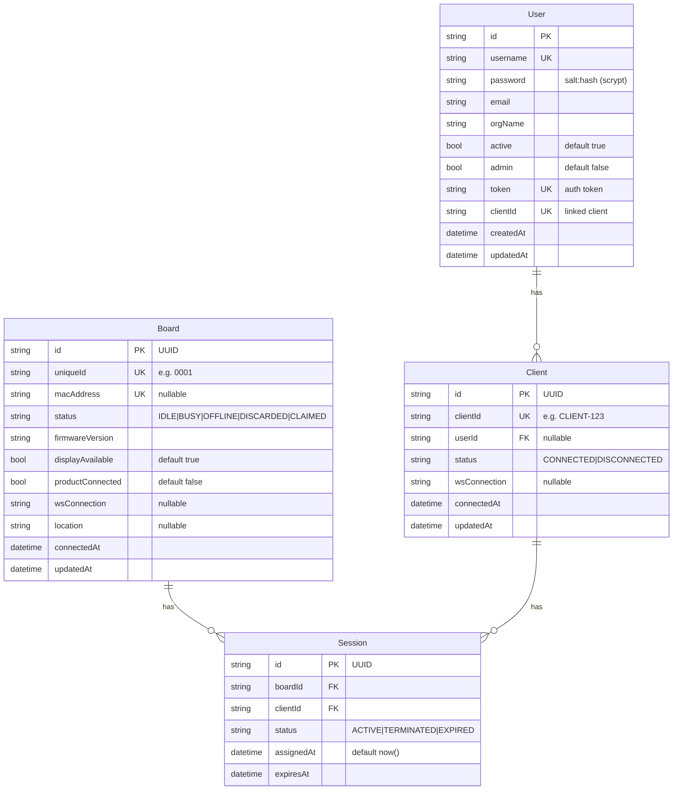

# Server Design

## Overview

Node.js server with Fastify (HTTP + static web dashboard) and `ws` WebSocket server. Manages board registration, client sessions, data relay between boards and clients, authentication, heartbeat monitoring, and session expiry.

## Architecture

```
External ──────┬────── HTTP :10008 ──── Fastify
               │         │
               │         ├── GET  /api/health
               │         ├── GET  /api/boards[/:id]
               │         ├── GET  /api/boards/idle
               │         ├── GET  /api/boards/onboarding?mac=
               │         ├── GET  /api/clients
               │         ├── GET  /api/users
               │         ├── GET  /api/sessions
               │         ├── POST /api/auth/register
               │         ├── POST /api/auth/login
               │         ├── POST /api/board/message
               │         ├── POST /api/onboarding/claim
               │         ├── POST /api/sessions
               │         ├── POST /api/control
               │         ├── POST /api/boards/:id/discard
               │         ├── POST /api/boards/discard-by-mac
               │         ├── PATCH /api/boards/:id
               │         └── GET  /* (SPA fallback → index.html)
               │
               └────── WS /ws/board ──── wss (WebSocketServer)
               └────── WS /ws/client ─── clientWss
               └────── WS /ws/monitor ── monitorWss

wss ➔ handleBoardMessage()
clientWss ➔ handleClientMessage()

Services: Heartbeat timer, Session expiry check (60s interval)
Database: MySQL via Prisma ORM
```

## Database Schema (Prisma)


```mermaid
erDiagram
    User ||--o{ Client : has
    Board ||--o{ Session : has
    Client ||--o{ Session : has

    User {
        string id PK
        string username UK
        string password "salt:hash (scrypt)"
        string email
        string orgName
        bool active "default true"
        bool admin "default false"
        string token UK "auth token"
        string clientId UK "linked client"
        datetime createdAt
        datetime updatedAt
    }

    Board {
        string id PK "UUID"
        string uniqueId UK "e.g. 0001"
        string macAddress UK "nullable"
        string status "IDLE|BUSY|OFFLINE|DISCARDED|CLAIMED"
        string firmwareVersion
        bool displayAvailable "default true"
        bool productConnected "default false"
        string wsConnection "nullable"
        string location "nullable"
        datetime connectedAt
        datetime updatedAt
    }

    Client {
        string id PK "UUID"
        string clientId UK "e.g. CLIENT-123"
        string userId FK "nullable"
        string status "CONNECTED|DISCONNECTED"
        string wsConnection "nullable"
        datetime connectedAt
        datetime updatedAt
    }

    Session {
        string id PK "UUID"
        string boardId FK
        string clientId FK
        string status "ACTIVE|TERMINATED|EXPIRED"
        datetime assignedAt "default now()"
        datetime expiresAt
    }
```

## In-Memory Maps

| Map | Key | Value | Purpose |
|-----|-----|-------|---------|
| `boardConnections` | `uniqueId` | `WebSocket` | Board WS → ID mapping |
| `clientConnections` | `clientId` | `WebSocket` | Client WS → ID mapping |
| `monitorConnections` | `uuid` | `WebSocket` | Monitor dashboard WS |
| `heartbeatTimers` | `uniqueId \| clientId` | `NodeJS.Timeout` | Heartbeat timeout timers |
| `boardCommandQueues` | `uniqueId` | `any[]` | Queued commands for boards |
| `boardLogs` | `uniqueId` | `LogEntry[]` | Board log buffer (max 500) |
| `discardAckWaiters` | `uniqueId` | `{ resolve, timer }` | DISCARD ACK promise waiters |

## WebSocket Endpoints

| Path | Server | Handler |
|------|--------|---------|
| `/ws/board` | `wss` | `handleBoardMessage()` |
| `/ws/client` | `clientWss` | `handleClientMessage()` |
| `/ws/monitor` | `monitorWss` | Log monitor connection |

Upgrade routing (single Fastify server): `upgrade` event → `URL.pathname` match → `wss.handleUpgrade()` / `clientWss.handleUpgrade()` / `monitorWss.handleUpgrade()`.

---

## Board WebSocket (`/ws/board`)

### Connection Lifecycle

1. ESP32 connects to `ws://host:10008/ws/board`
2. Sends `REGISTER` with boardId (MAC), firmwareVersion, displayAvailable, productConnected
3. Server assigns/creates board record, sends `ASSIGN_ID` back
4. `boardConnections.set(uniqueId, ws)`, start heartbeat timer
5. On close: mark board OFFLINE, find all ACTIVE sessions → TERMINATED, send `END_SESSION` to clients

### `handleBoardMessage(ws, msg, setBoardId)`

| `type` | Action |
|--------|--------|
| `REGISTER` | Look up by `uniqueId` (pre-assigned) or `macAddress`. Create or update board in DB. Set `boardConnections`. Send `ASSIGN_ID` + flush queued commands. Start heartbeat timer |
| `HEARTBEAT` | Reset heartbeat timer, send `HEARTBEAT` pong |
| `DATA_RELAY` | Find session → find client WS → relay payload. Reset heartbeat timer |
| `DISCARD_ACK` | Resolve discard waiter promise |
| `LOG` | Store in `boardLogs`, broadcast to monitors |

**REGISTER detail:**

- If `preAssignedId` (uniqueId from mobile claim):
  - Find existing claimed board → update firmware/status
  - If not found → create with preAssignedId
- If no preAssignedId:
  - Find existing by MAC address
  - If DISCARDED → delete and recreate with new uniqueId
  - If new → generate next `padStart(4, '0')` uniqueId
- Update `productConnected` from REGISTER payload

---

## Client WebSocket (`/ws/client`)

### Connection Lifecycle

1. Electron client connects to `ws://host:10008/ws/client`
2. Sends `REQUEST_BOARD` with clientId/token
3. Server: resolve user by token, setup client, terminate existing sessions for this client, **clean up orphaned BUSY boards** (3 cases), find IDLE board with WS connection, create session, update board to BUSY, send `BOARD_READY` to both board and client

### `handleClientMessage(ws, msg, setClientId)`

| `type` | Action |
|--------|--------|
| `REQUEST_BOARD` | See below |
| `HEARTBEAT` | Reset heartbeat timer, send pong |
| `DATA_RELAY` | Find session → find board WS → relay payload |

### REQUEST_BOARD Handler (the core logic)

1. **Auth**: If `token` present, `findUnique({ token })` → get userId
2. **Client setup**: Find or create client record. Update `userId` if authenticated
3. **Terminate existing sessions**: `findMany({ clientId: client.id, status: ACTIVE })` → TERMINATED, send CONTROL DISCONNECT to each board
4. **Orphaned BUSY board cleanup** (3 cases):
   - BUSY boards with **no ACTIVE sessions**: board → IDLE
   - BUSY boards with ACTIVE sessions but **client WS gone** (not in `clientConnections` or not OPEN): session → TERMINATED, CONTROL DISCONNECT to board, board → IDLE
   - BUSY boards with ACTIVE sessions and **client WS still alive**: left alone (not orphaned)
5. **Find idle board**: Query DB `status: IDLE`, filter `boardConnections.has(b.uniqueId) && readyState === OPEN`
6. **No boards**: Send ERROR `BOARD_NOT_FOUND`. Also mark orphaned IDLE boards as OFFLINE
7. **Assign**: Create session (ACTIVE), board → BUSY, send `BOARD_READY` to board and client (client gets `productConnected` field)
8. Start client heartbeat timer

---

## Heartbeat System

| Connection | Timer duration | Reset on | Timeout action |
|------------|---------------|----------|----------------|
| Board | `HEARTBEAT_TIMEOUT_MS` (shared constant) | Any board WS message (REGISTER, HEARTBEAT, DATA_RELAY, LOG) | Mark OFFLINE, close WS, find ACTIVE sessions → TERMINATED, send `END_SESSION` to clients |
| Client | Same | HEARTBEAT | (Same pattern) |

The heartbeat timer is a `setTimeout` per connection, reset on every incoming message. On timeout:
1. Board/Client update in DB
2. WS close/delete from map
3. All ACTIVE sessions → TERMINATED
4. `END_SESSION` sent to connected client WS

---

## Session Expiry (`checkExpiredSessions`)

Runs every 60 seconds (`setInterval`). For each ACTIVE session where `expiresAt < now`:
1. Session → EXPIRED
2. Board → IDLE
3. Send CONTROL DISCONNECT to board
4. Send `END_SESSION` to client WS

---

## Message Protocol

### Board → Server (WebSocket or HTTP POST `/api/board/message`)

**REGISTER:**
```json
{
  "type": "REGISTER", "version": "1.0", "timestamp": 1700000,
  "boardId": "AA:BB:CC:DD:EE:FF",
  "firmwareVersion": "1.0.0",
  "displayAvailable": true,
  "productConnected": false,
  "uniqueId": "0042"
}
```

**HEARTBEAT:**
```json
{ "type": "HEARTBEAT", "version": "1.0", "timestamp": 1700000, "id": "0042" }
```

**DATA_RELAY:**
```json
{ "type": "DATA_RELAY", "sessionId": "uuid", "direction": "B_TO_C", "payload": "base64..." }
```

**DISCARD_ACK:**
```json
{ "type": "DISCARD_ACK", "timestamp": 1700000, "id": "0042" }
```

**LOG:**
```json
{ "type": "LOG", "level": "info", "message": "...", "data": { ... }, "id": "0042" }
```

### Server → Board (WebSocket)

**ASSIGN_ID:**
```json
{ "type": "ASSIGN_ID", "uniqueId": "0042", "serverTime": 1700000 }
```

**BOARD_READY:**
```json
{ "type": "BOARD_READY", "version": "1.0", "sessionId": "uuid", "boardId": "0001", "assignedAt": ..., "expiresAt": ... }
```

**CONTROL:**
```json
{ "type": "CONTROL", "action": "DISCONNECT", "reason": "client_disconnected" }
{ "type": "CONTROL", "action": "RESET", "reason": "admin_request" }
{ "type": "CONTROL", "action": "DISCARD", "reason": "admin_discard" }
```

**END_SESSION:**
```json
{ "type": "END_SESSION", "version": "1.0", "sessionId": "uuid", "reason": "board_timeout" }
```

**HEARTBEAT (pong):**
```json
{ "type": "HEARTBEAT", "version": "1.0", "timestamp": 1700000, "id": "0042" }
```

### Client → Server (WebSocket)

**REQUEST_BOARD:**
```json
{
  "type": "REQUEST_BOARD", "version": "1.0", "timestamp": 1700000,
  "clientId": "CLIENT-123", "sessionDuration": 3600, "token": "auth-token"
}
```

**HEARTBEAT:**
```json
{ "type": "HEARTBEAT", "version": "1.0", "timestamp": 1700000, "id": "CLIENT-123" }
```

**DATA_RELAY:**
```json
{ "type": "DATA_RELAY", "sessionId": "uuid", "direction": "C_TO_B", "payload": "base64..." }
```

**CLIENT_READY:**
```json
{ "type": "CLIENT_READY", "sessionId": "uuid", "timestamp": 1700000 }
```

### Server → Client (WebSocket)

**BOARD_READY:**
```json
{
  "type": "BOARD_READY", "version": "1.0", "timestamp": 1700000,
  "boardId": "0001", "sessionId": "uuid",
  "assignedAt": 1700000, "expiresAt": 1703600,
  "productConnected": false
}
```

**END_SESSION:**
```json
{ "type": "END_SESSION", "version": "1.0", "sessionId": "uuid", "reason": "board_disconnected" }
```

**CONTROL (SESSION_TERMINATED):**
```json
{ "type": "CONTROL", "action": "SESSION_TERMINATED", "reason": "admin_request", "sessionId": "uuid" }
```

**AUTH_INFO:**
```json
{ "type": "AUTH_INFO", "userId": "uuid", "clientId": "CLIENT-123" }
```

**ERROR:**
```json
{ "type": "ERROR", "code": "BOARD_NOT_FOUND", "message": "No idle boards available" }
{ "type": "ERROR", "code": "SESSION_EXPIRED", "message": "Session has expired" }
```

**DATA_RELAY:**
```json
{ "type": "DATA_RELAY", "sessionId": "uuid", "sourceId": "BOARD-0001", "direction": "B_TO_C", "payload": "base64..." }
```

---

## HTTP API Endpoints

| Method | Path | Description |
|--------|------|-------------|
| GET | `/api/health` | Health check |
| GET | `/api/boards` | List all boards (desc connectedAt) |
| GET | `/api/boards/idle` | List IDLE boards |
| GET | `/api/boards/:id` | Board detail + logs + WS connected status |
| GET | `/api/boards/onboarding?mac=` | Check if MAC registered (mobile polling) |
| POST | `/api/onboarding/claim` | Pre-claim uniqueId for MAC (mobile) |
| POST | `/api/board/message` | HTTP alternative to board WS (REGISTER/HEARTBEAT/DATA_RELAY) |
| GET | `/api/clients` | List clients (with user info) |
| GET | `/api/users` | List users |
| POST | `/api/users/:id/toggle` | Toggle user active |
| POST | `/api/users/:id/toggle-admin` | Toggle user admin |
| GET | `/api/sessions` | List recent 100 sessions |
| POST | `/api/sessions` | Create session (admin) |
| DELETE | `/api/sessions/:id` | Remove session |
| POST | `/api/sessions/:id/terminate` | Terminate session |
| POST | `/api/control` | Send control command (type=board/client) |
| POST | `/api/boards/:id/discard` | Discard board (send DISCARD, wait for ACK 5s) |
| POST | `/api/boards/discard-by-mac` | Discard board by MAC (mobile cleanup) |
| PATCH | `/api/boards/:id` | Update board (location field) |
| POST | `/api/auth/register` | Register user (scrypt password hashing) |
| POST | `/api/auth/login` | Login — returns userId/username/email/orgName/token |
| GET | `/*` | SPA fallback (serve index.html) |

---

## Key Design Decisions

### BUSY Board Cleanup (3 cases in REQUEST_BOARD)

The server handles stale BUSY boards that may result from:
1. **Client WS disconnected without cleanup** → `findMany` in WS close handler terminates sessions
2. **Race condition**: WS close handler hasn't completed by the time next `REQUEST_BOARD` arrives → REQUEST_BOARD re-checks `clientConnections` for each BUSY session and cleans up orphans
3. **BUSY with no sessions** (inconsistent DB state) → directly set IDLE

All three cases are handled idempotently in `handleClientMessage` REQUEST_BOARD handler.

### Session Cleanup on Client Disconnect

Client WS close handler:
1. Delete from `clientConnections`, clear heartbeat timer
2. `findMany({ clientId, status: ACTIVE })` → TERMINATED
3. For each: send CONTROL DISCONNECT to board, set board IDLE

### Board Disconnect Propagation

Board WS close handler:
1. Delete from `boardConnections`, clear heartbeat timer, set board OFFLINE
2. `findMany({ board: uniqueId, status: ACTIVE })` → TERMINATED
3. For each: send `END_SESSION` to client WS

### Heartbeat Timeout

- Board WS close propagated to all clients (same as manual close)
- Client heartbeat timeout → no session cleanup needed (client reconnection handles it)

## Startup

1. Start Fastify on `PORT` (env or 10008)
2. Serve static web dashboard from `apps/web/dist/` if available
3. Start WS upgrade routing
4. Mark all IDLE/BUSY boards as OFFLINE (fresh start)
5. `setInterval(checkExpiredSessions, 60000)`

## Key Files

| File | Lines | Contents |
|------|-------|----------|
| `src/index.ts` | ~1233 | All server logic — HTTP routes, WS handlers, heartbeat, session management |
| `prisma/schema.prisma` | ~61 | MySQL schema: Board, User, Client, Session |
