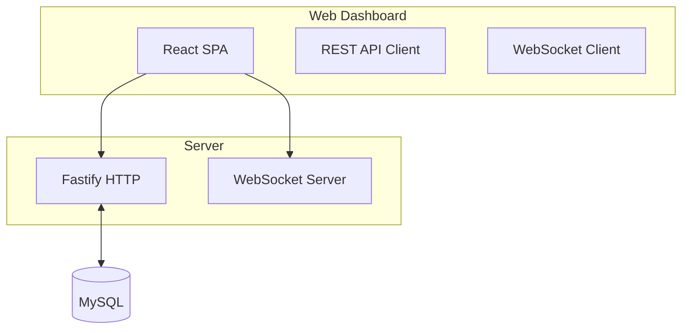
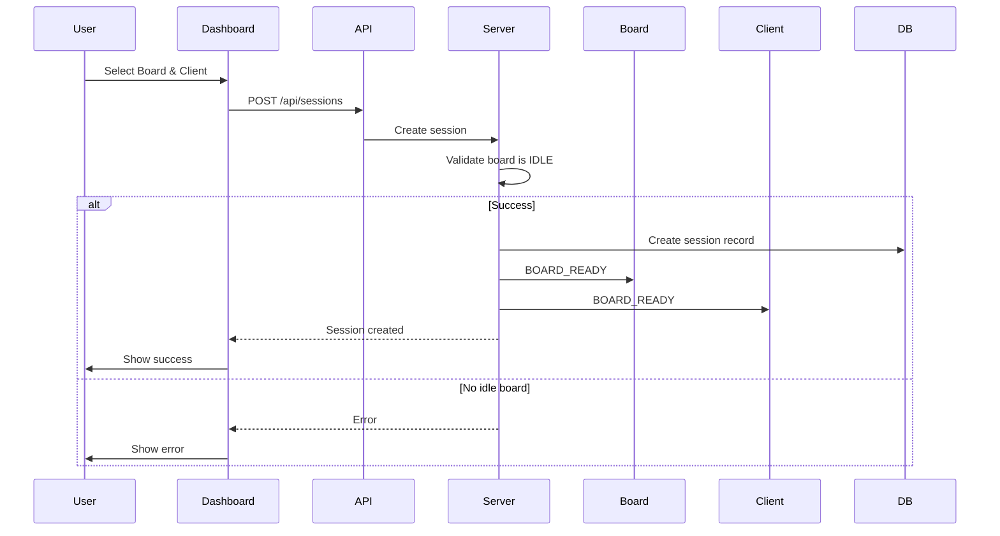
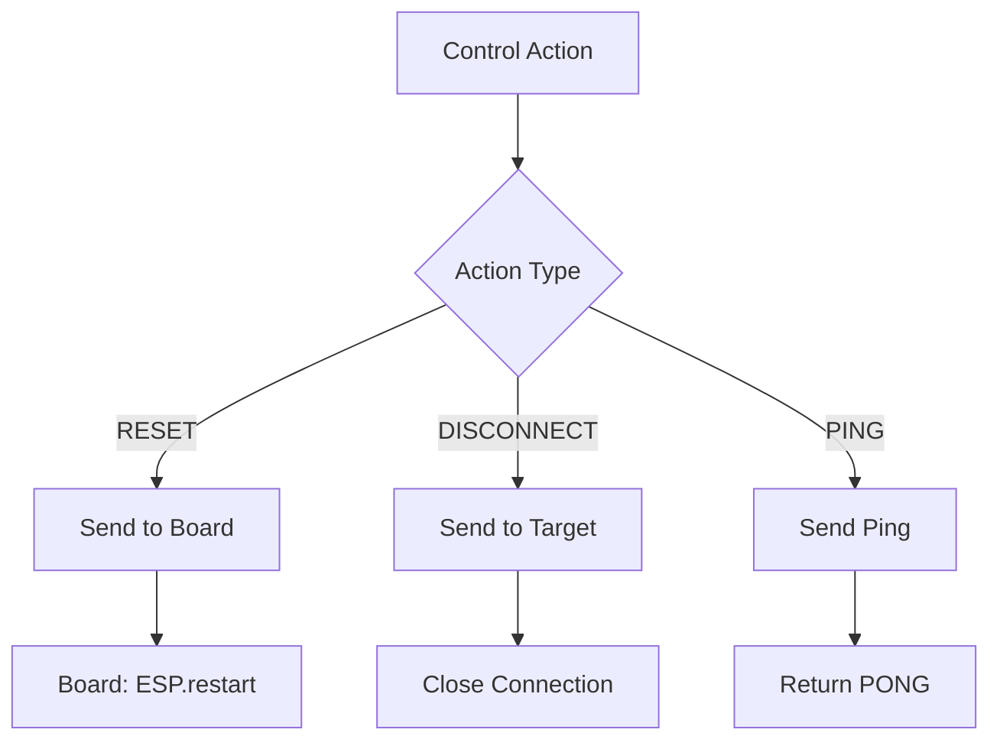

# Web Dashboard Design

## Overview

React-based web dashboard for monitoring and managing boards, clients, and sessions in real-time.

## Architecture



## Dashboard Layout

```
┌──────────────────────────────────────────────────────┐
│  Nexio Dashboard                              [🔄]  │
├──────────────────────────────────────────────────────┤
│                                                      │
│  ┌────────────────────┐  ┌────────────────────┐     │
│  │ Boards (3)         │  │ Clients (2)        │     │
│  │                    │  │                    │     │
│  │ 🔵 BOARD-0001 IDLE │  │ ● CLIENT-1 CONNECTED│    │
│  │ 🟢 BOARD-0002 BUSY  │  │ ● CLIENT-2 CONNECTED│    │
│  │ 🔴 BOARD-0003 OFF   │  │                    │     │
│  └────────────────────┘  └────────────────────┘     │
│                                                      │
│  ┌─ Create Session ───────────────────────────────┐ │
│  │ Board: [BOARD-0001 ▼]                          │ │
│  │ Client: [CLIENT-1 ▼]                           │ │
│  │ [Connect]                                      │ │
│  └───────────────────────────────────────────────┘ │
│                                                      │
└──────────────────────────────────────────────────────┘
```

## Board List Component

```
┌────────────────────────────────────────┐
│ Boards (3)                     [+ Add]│
├────────────────────────────────────────┤
│ Unique ID    │ Status │ Connected    │
├────────────────────────────────────────┤
│ BOARD-0001   │ IDLE   │ 12:00:00     │
│ BOARD-0002   │ BUSY   │ 11:30:00     │
│ BOARD-0003   │ OFFLINE│ 10:15:00     │
└────────────────────────────────────────┘
         [Reset] [Disconnect]
```

## Client List Component

```
┌────────────────────────────────────────┐
│ Clients (2)                     [+ Add]│
├────────────────────────────────────────┤
│ Client ID     │ Status    │ Connected │
├────────────────────────────────────────┤
│ CLIENT-1      │ CONNECTED │ 12:00:00  │
│ CLIENT-2      │ CONNECTED │ 11:45:00  │
└────────────────────────────────────────┘
         [Ping] [Disconnect]
```

## Session Management



## Control Actions



## API Integration

| Method | Endpoint | Description |
|--------|----------|-------------|
| GET | `/api/boards` | Get all boards |
| GET | `/api/boards/idle` | Get idle boards |
| GET | `/api/clients` | Get all clients |
| POST | `/api/sessions` | Create session |
| DELETE | `/api/sessions/:id` | Delete session |
| POST | `/api/control` | Send control |

## Real-time Updates

- Auto-refresh every 5 seconds
- WebSocket connection for live updates (optional)
- Visual status indicators with colors

## Status Colors

| Status | Color | Meaning |
|--------|-------|---------|
| IDLE | 🟢 Green | Board ready for use |
| BUSY | 🟡 Yellow | Board in use |
| OFFLINE | 🔴 Red | Board disconnected |
| CONNECTED | 🟢 Green | Client connected |
| DISCONNECTED | 🔴 Red | Client disconnected |