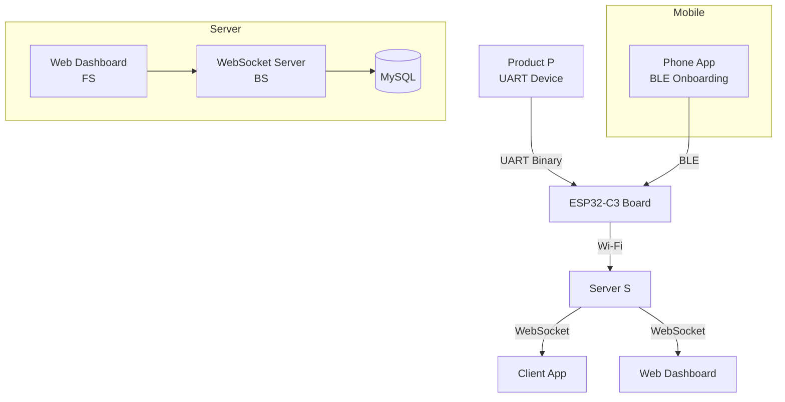
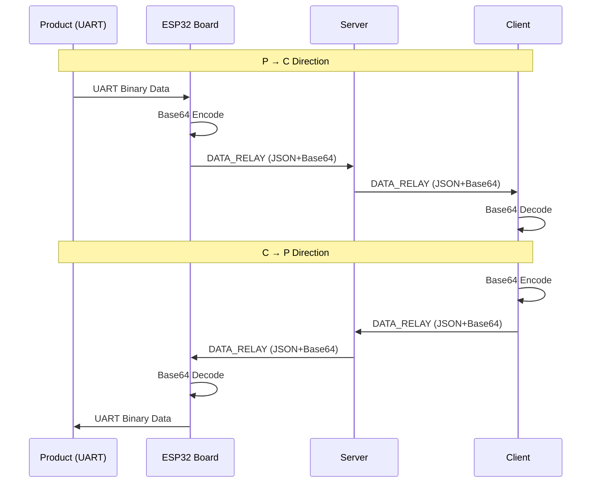
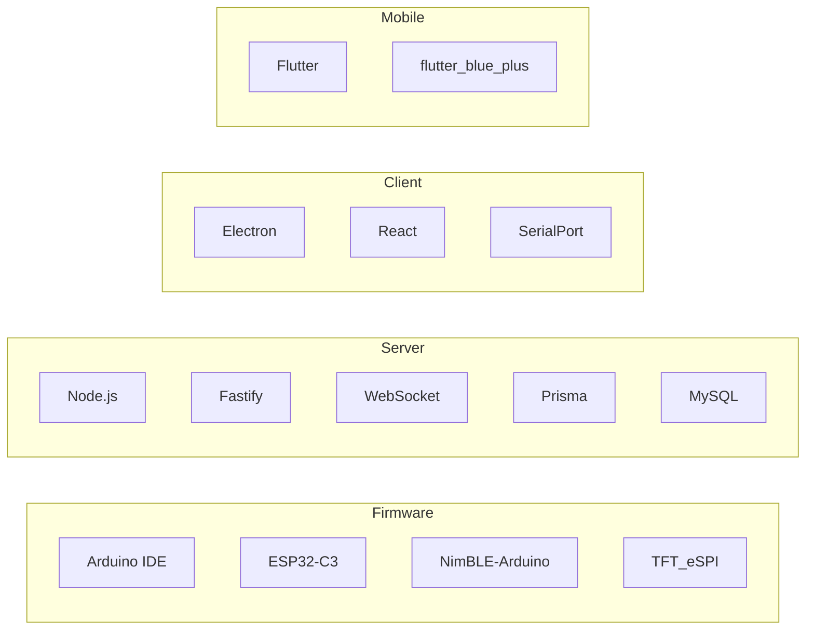
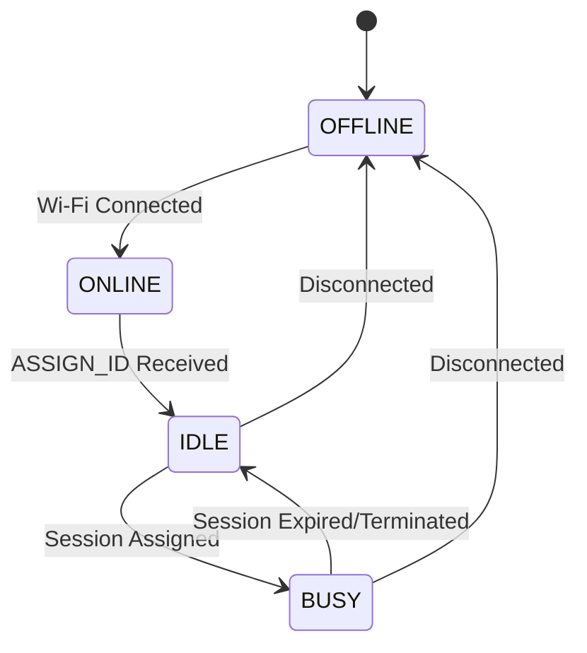

# Nexio - ESP32 Wireless UART Bridge System

## System Architecture Overview



## Data Flow



## System Components

| Component | Identifier | Description |
|------------|------------|-------------|
| Product | P | UART device that sends/receives binary data |
| ESP32 Board | B | QSZNTEC ESP32-C3 with 1.28" round display |
| Server | S | Relay server (BS + FS) |
| Client App | C | Desktop/Web application |
| Phone App | A | BLE-based ESP32 onboarding mobile app |

## Technology Stack



## Communication Protocol

### Message Format

All messages follow this structure:

```json
{
  "type": "MESSAGE_TYPE",
  "version": "1.0",
  "timestamp": 1700000000000
}
```

### Board ↔ Server Flow



## Project Structure

```
nexio/
├── docker-compose.yml              # Root: MySQL + Server
├── firmware/                       # ESP32-C3 Arduino
├── apps/
│   ├── server/                    # Node.js + Fastify + WebSocket
│   ├── client/                     # Electron Desktop App
│   ├── web/                        # React Dashboard
│   └── mobile/                     # Flutter BLE App
└── packages/
    └── shared-types/               # TypeScript Message Types
```

## Security

- WebSocket: WSS (TLS) in production, WS allowed in development
- Board identification: MAC address based, server issues uniqueId
- Client authentication: Optional (JWT can be added later)

## Real-time Requirements

- DATA_RELAY: Forward immediately (no buffering)
- WebSocket latency target: < 50ms (local network)
