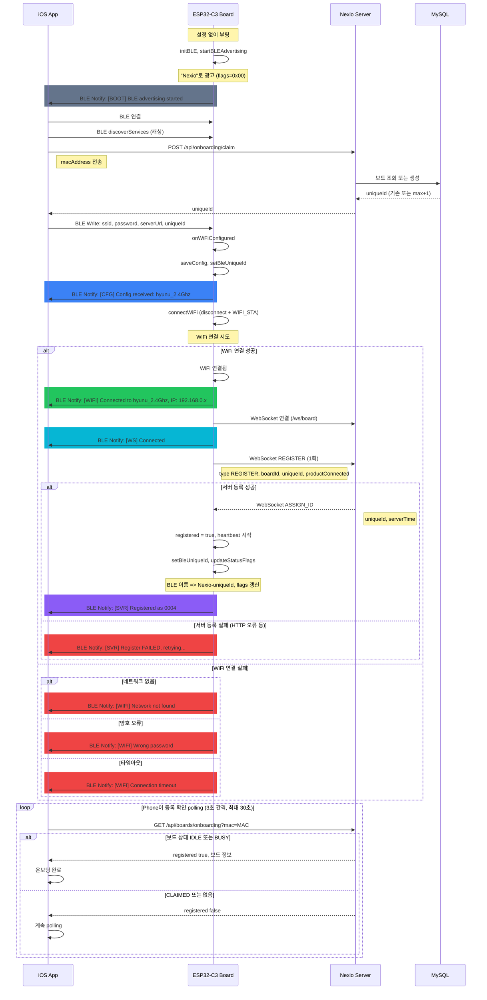
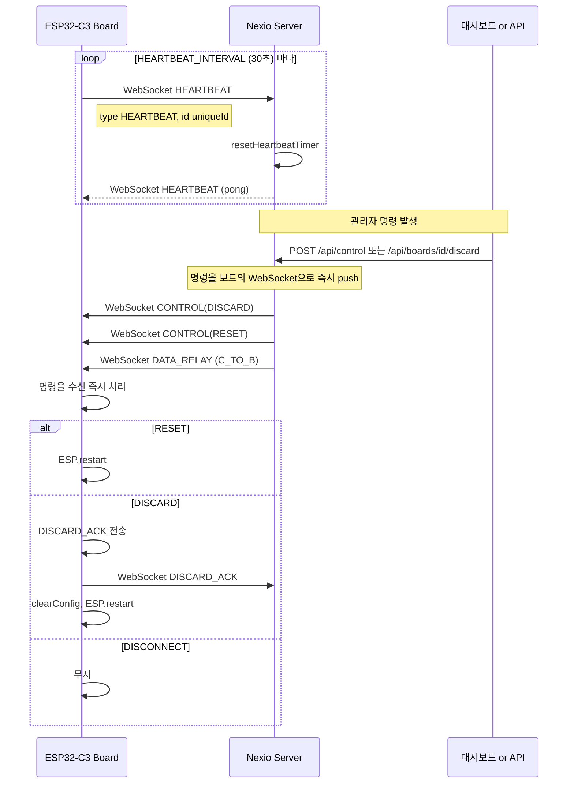
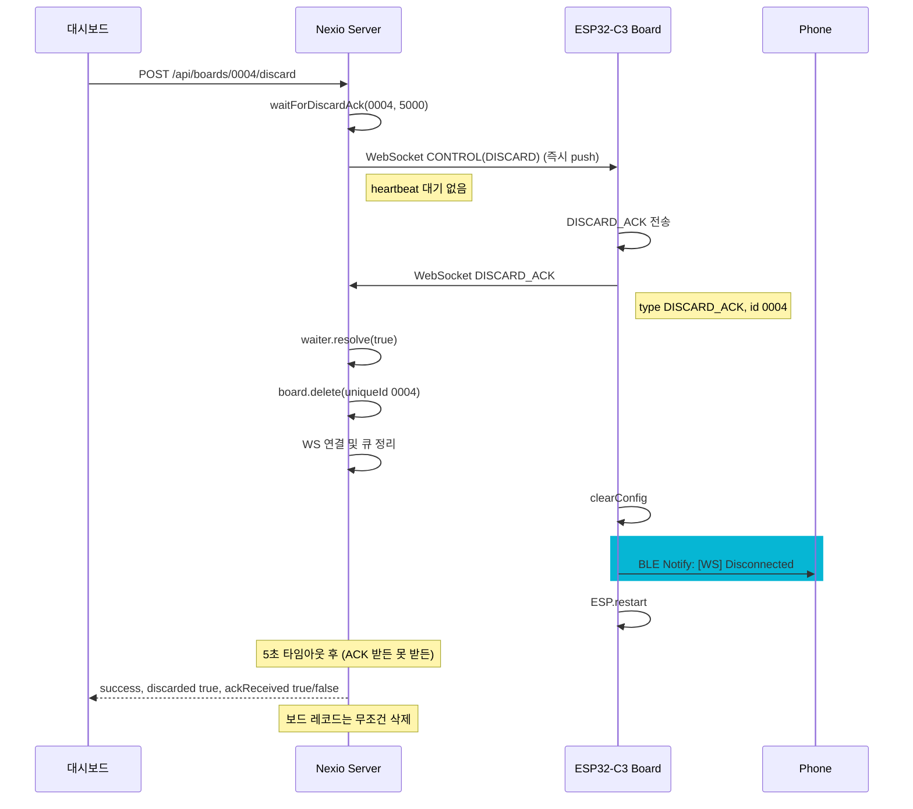
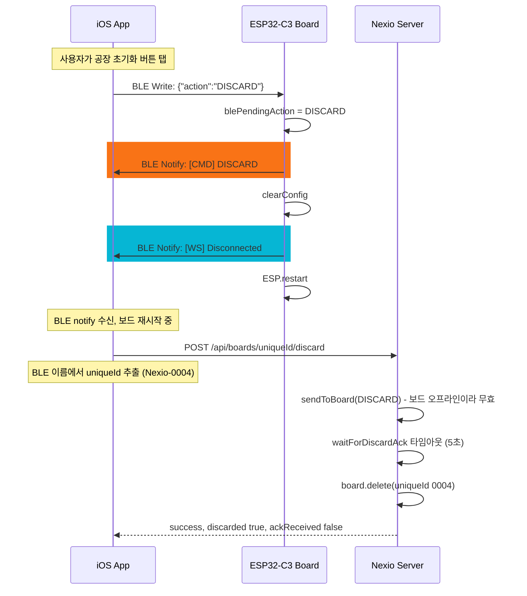
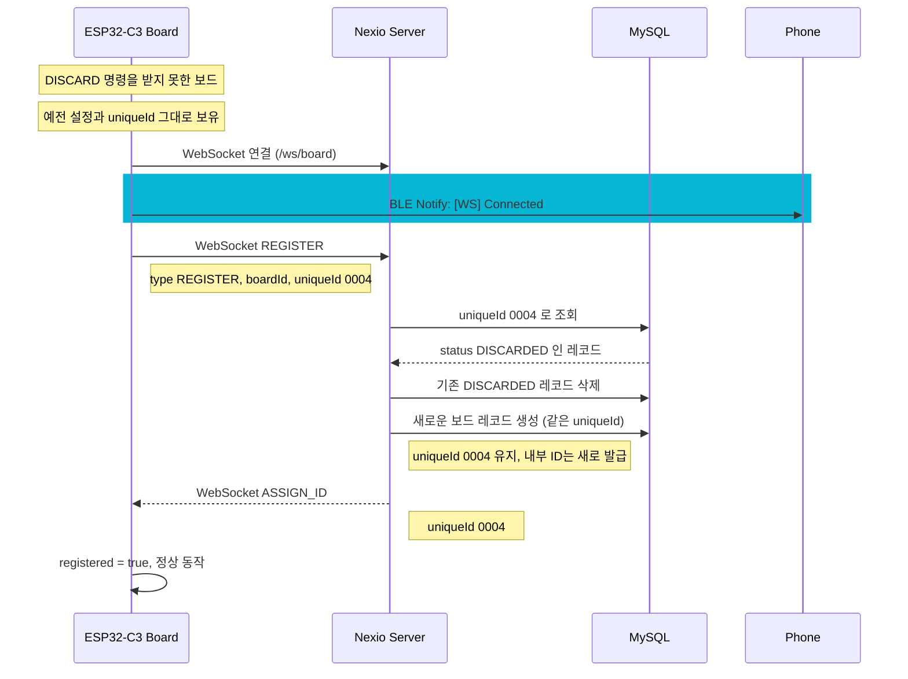
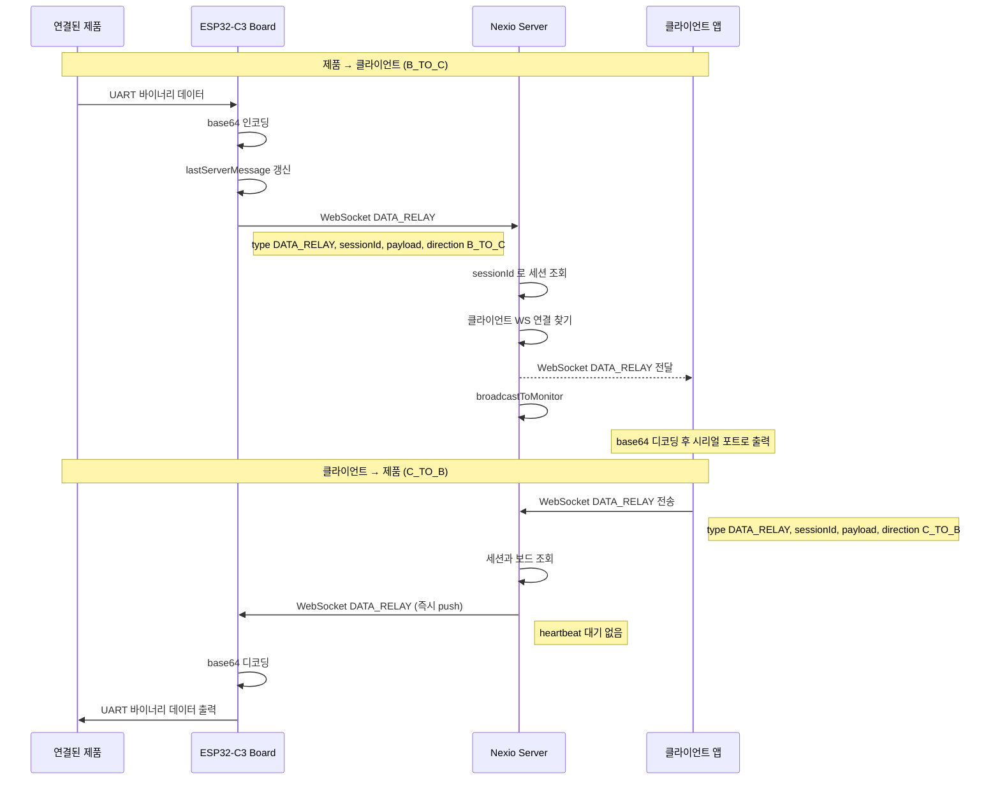
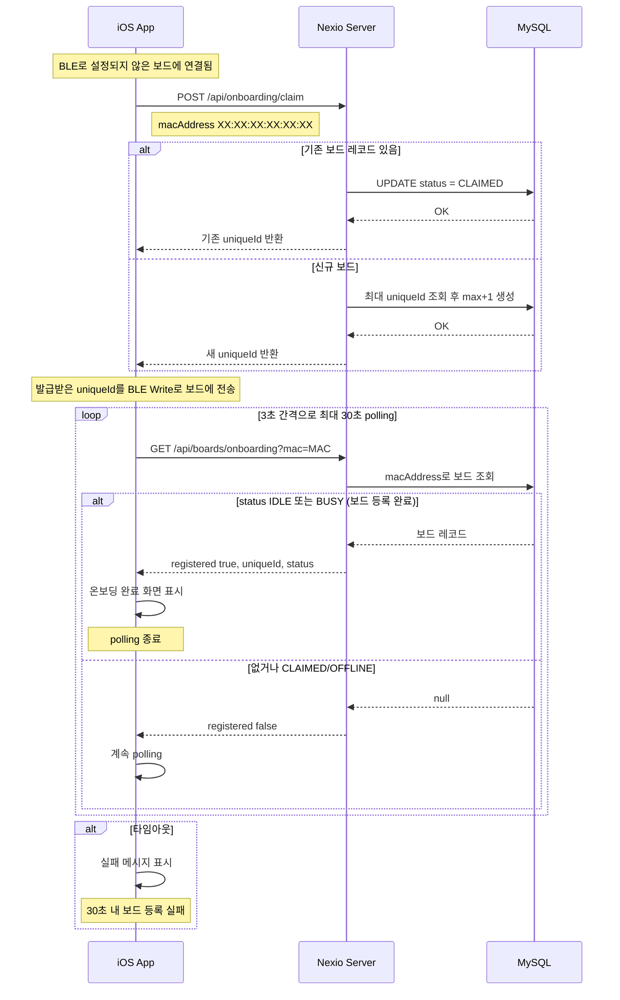
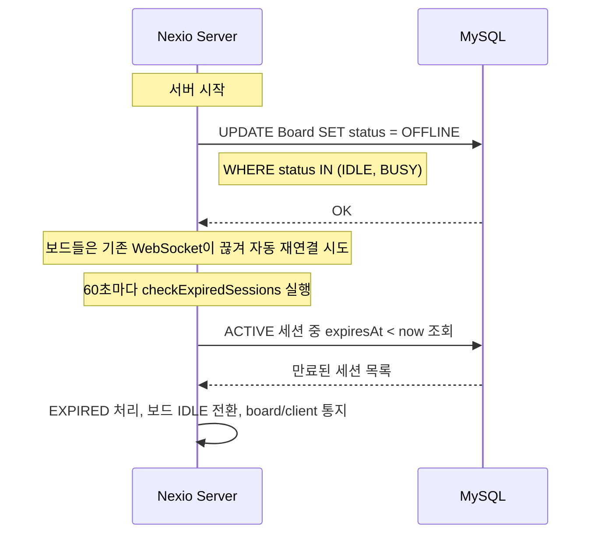

# 통신 시퀀스 다이어그램

## BLE 알림 메시지 색상 범례

Phone 앱의 로그 패널에 표시되는 BLE 알림 메시지의 색상 구분:

| 태그 | 색상 | 의미 | 발생 시점 |
|------|------|------|----------|
| `[BOOT]` | 회색 (#94a3b8) | 시스템 부팅/초기화 | `setup()` 실행 시 |
| `[CFG]` | 파랑 (#3b82f6) | 설정 수신/저장 | BLE Write 수신 후 |
| `[WIFI]` | 초록 (#22c55e) | WiFi 연결 성공 | WiFi 연결 완료 |
| `[WIFI]` | 빨강 (#ef4444) | WiFi 연결 실패 | WiFi 타임아웃/암호 오류 |
| `[SVR]` | 보라 (#8b5cf6) | 서버 등록 성공 | ASSIGN_ID 수신 |
| `[SVR]` | 빨강 (#ef4444) | 서버 등록 실패 | REGISTER HTTP 오류 |
| `[WS]` | 청록 (#06b6d4) | WebSocket 연결/해제 | WS 연결 성공 또는 끊김 |
| `[CMD]` | 주황 (#f59e0b) | BLE 명령 수신 확인 | Phone이 RESET/DISCARD 전송 시 |

---

## 1. BLE 온보딩 (설정 전 → 등록 완료)



## 2. 하트비트 및 명령 전달



## 3. HTTP 기반 DISCARD 플로우 (대시보드)



## 4. BLE 기반 DISCARD 플로우 (Phone)



## 5. DISCARDED 보드 재등록



## 6. MAC 충돌 해결

```mermaid
sequenceDiagram
    participant Board as ESP32-C3 Board
    participant Server as Nexio Server
    participant DB as MySQL

    Note over Board: MAC: 88:56:A6:7D:0A:B0, uniqueId: 0004
    Note over Board: BLE MAC과 WiFi MAC은 마지막 옥텟이 1 차이

    Board->>Server: WebSocket 연결 (/ws/board)

    rect rgb(6, 182, 212)
        Board->>Phone: BLE Notify: [WS] Connected
    end

    Board->>Server: WebSocket REGISTER
    Note right of Board: type REGISTER, boardId MAC, uniqueId 0004

    Server->>DB: uniqueId 0004 로 조회
    DB--->>Server: 보드 레코드 존재

    alt 다른 보드가 같은 MAC 사용 중
        Server->>DB: UPDATE macAddress = NULL
        Note right of Server: WHERE macAddress = MAC AND id != 현재
    end

    Server->>DB: UPDATE macAddress = MAC, status = IDLE
    DB-->>Server: OK
    Server-->>Board: WebSocket ASSIGN_ID
    Server-->>Board: WebSocket HEARTBEAT (pong) 시작
```

## 7. 데이터 중계 (양방향)



## 8. 온보딩 Claim 플로우



## 9. 서버 기동 복구



## 10. BLE 알림 메시지 전체 목록

펌웨어에서 Phone으로 BLE TX characteristic을 통해 전송하는 모든 알림 메시지:

| 순서 | 태그 | 메시지 | 발생 조건 | Phone 화면 색상 |
|------|------|--------|----------|---------------|
| 1 | `[BOOT]` | `BLE advertising started` | `setup()`에서 BLE 광고 시작 | 회색 |
| 2 | `[BOOT]` | `Config loaded` | `setup()`에서 기존 설정 발견 (재부팅 시) | 회색 |
| 3 | `[CFG]` | `Config received: {SSID}` | Phone에서 BLE Write로 설정 수신 | 파랑 |
| 4 | `[WIFI]` | `Connected to {SSID}, IP: {IP}` | WiFi 연결 성공 | 초록 |
| 5 | `[WIFI]` | `Network not found` | WiFi AP를 찾을 수 없음 | 빨강 |
| 6 | `[WIFI]` | `Wrong password` | WiFi 암호 오류 | 빨강 |
| 7 | `[WIFI]` | `Connection timeout` | WiFi 연결 시간 초과 | 빨강 |
| 8 | `[SVR]` | `Registered as {uniqueId}` | 서버 등록 성공 (ASSIGN_ID 수신) | 보라 |
| 9 | `[SVR]` | `Register FAILED, retrying...` | 서버 등록 HTTP 오류 | 빨강 |
| 10 | `[WS]` | `Connected` | WebSocket 서버 연결 성공 | 청록 |
| 11 | `[WS]` | `Disconnected` | WebSocket 연결 끊김 | 청록 |
| 12 | `[CMD]` | `{action}` | BLE 명령어 수신 확인 (RESET/DISCARD) | 주황 |
