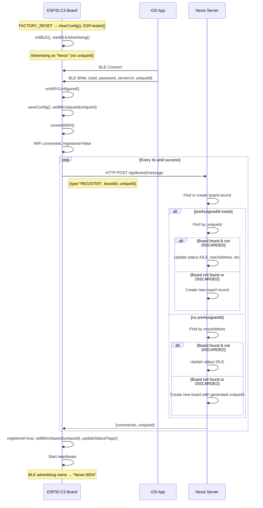
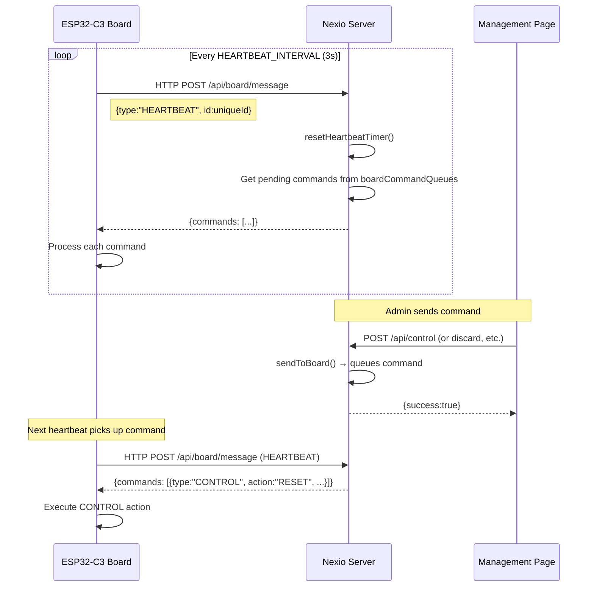
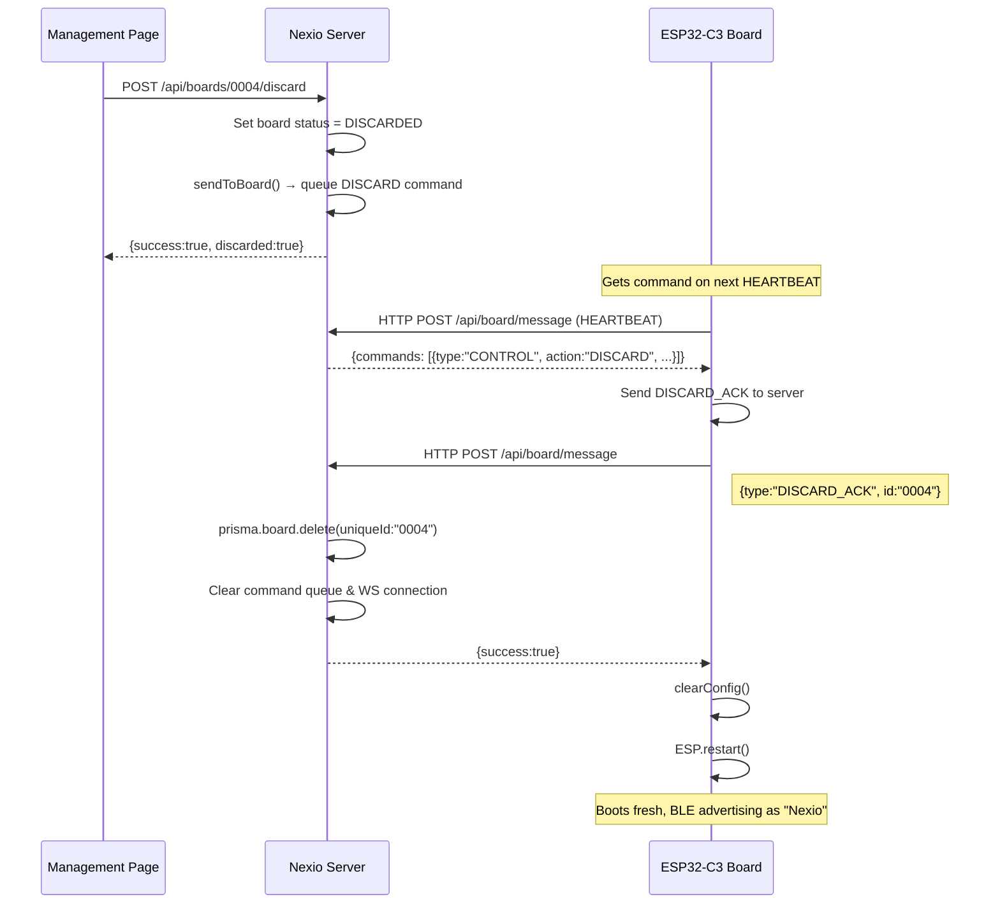
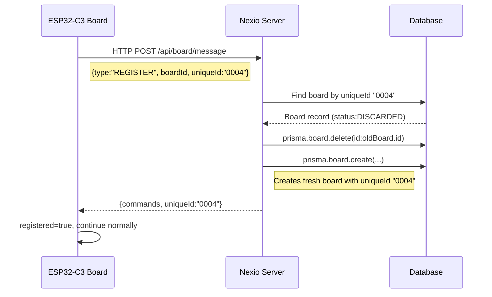
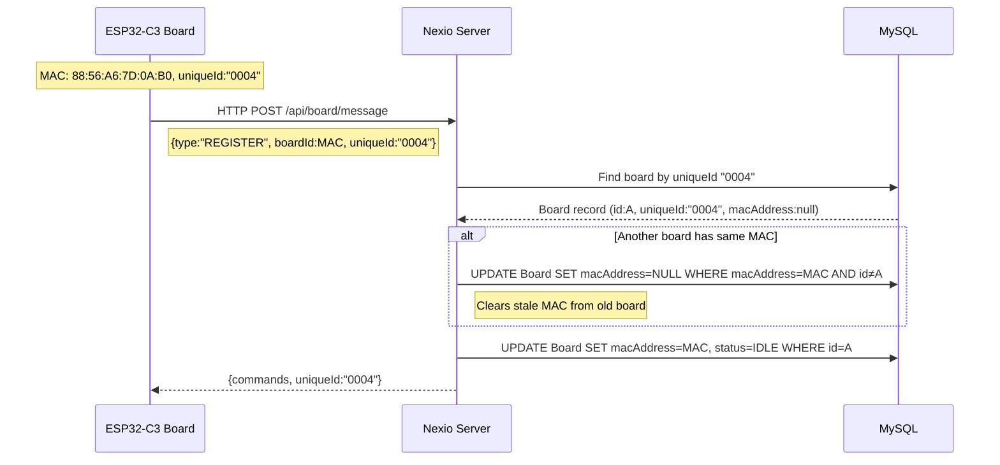
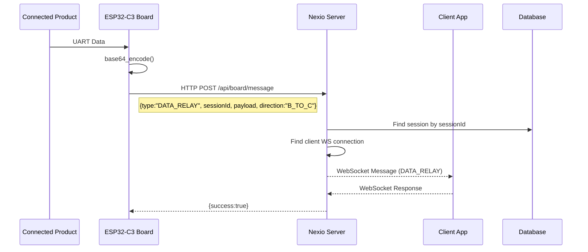
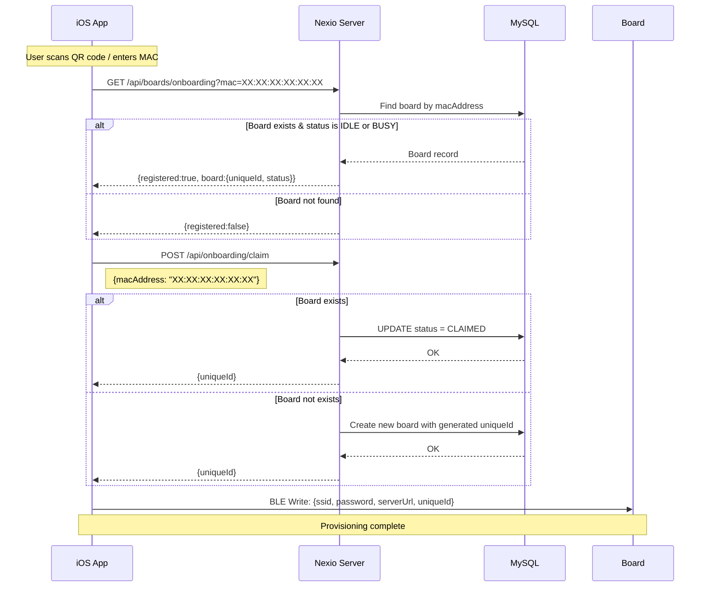

# Communication Sequence Diagrams

## 1. BLE Provisioning (Factory Reset → Onboarding)

## 2. Heartbeat & Command Delivery

## 3. DISCARD Flow (New)

## 4. DISCARDED Board Re-registration

When a DISCARDED board (that never received the DISCARD command) tries to REGISTER:

## 5. MAC Conflict Resolution

After FACTORY_RESET, the board re-registers with the same MAC but potentially different uniqueId:

## 6. Data Relay (UART → Server → Client)

## 7. Onboarding Claim Flow

