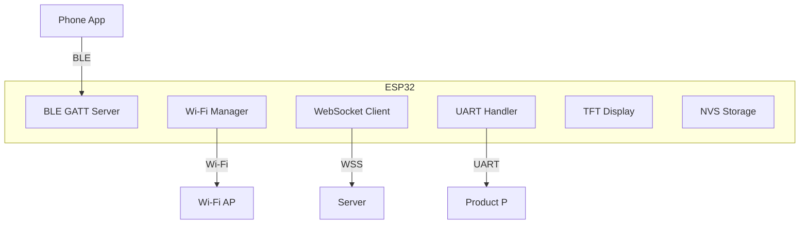
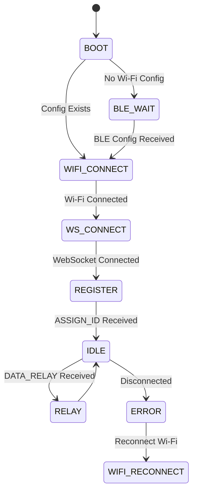
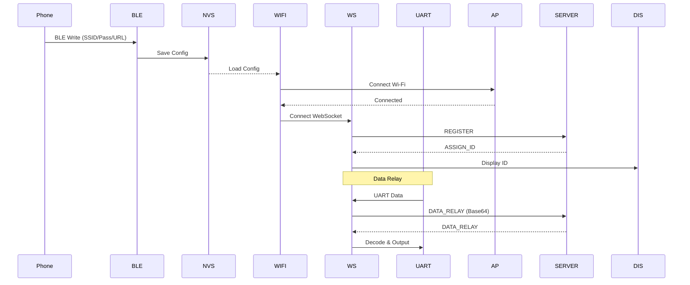
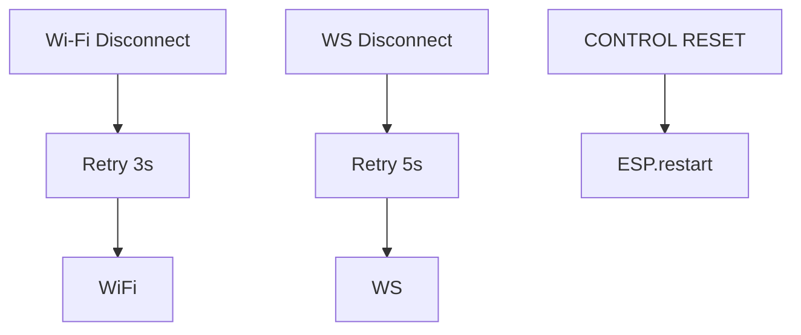

# ESP32-C3 Firmware Design

## Overview

ESP32-C3 firmware for QSZNTEC 1.28" round display board. Handles BLE onboarding, Wi-Fi connection, WebSocket communication, and UART data relay.

## System Diagram



## State Machine



## Data Flow



## Module Design

### BLE Module (`ble.cpp`)

```
┌─────────────────────────────────────────┐
│           BLE GATT Server               │
├─────────────────────────────────────────┤
│ Service UUID: 6e400001-...              │
│                                         │
│ TX (Notify): 6e400002-...  ──► Phone   │
│ RX (Write):  6e400003-...  ◄── Phone  │
└─────────────────────────────────────────┘
```

**Characteristic RX receives JSON:**
```json
{
  "ssid": "MyWiFi",
  "password": "password123",
  "serverUrl": "ws://192.168.1.100:10008/ws/board"
}
```

### Wi-Fi Module (`wifi.cpp`)

- Stores SSID, Password, Server URL in NVS
- Auto-connect on boot
- Reconnect on disconnect

### WebSocket Module (`websocket.cpp`)

- SSL/TLS connection to server
- Auto-reconnect with 5s interval
- Heartbeat every 30s

### UART Module (`uart.cpp`)

- Baud rate: 115200 (configurable)
- Data: Binary (passthrough)
- Encoding: Base64 for JSON payload

### Display Module (`display.cpp`)

```
┌────────────────────┐
│     Nexio          │
│ WiFi: Connected    │
│ SSID: MyNetwork   │
│ WS: Connected     │
│ ID: BOARD-0001    │
└────────────────────┘
```

## Pin Configuration

| Pin | Function | Notes |
|-----|----------|-------|
| 7 | UART TX | Product RX |
| 6 | UART TX | Product TX |
| 10 | TFT CS | Display |
| 2 | TFT DC | Display |
| 3 | TFT RST | Display |

## Message Protocol

### Outgoing: REGISTER
```json
{
  "type": "REGISTER",
  "version": "1.0",
  "timestamp": 1700000000000,
  "boardId": "AA:BB:CC:DD:EE:FF",
  "firmwareVersion": "1.0.0",
  "displayAvailable": true
}
```

### Incoming: ASSIGN_ID
```json
{
  "type": "ASSIGN_ID",
  "version": "1.0",
  "timestamp": 1700000000000,
  "uniqueId": "BOARD-0001",
  "serverTime": 1700000000000
}
```

### DATA_RELAY (P → C)
```json
{
  "type": "DATA_RELAY",
  "version": "1.0",
  "timestamp": 1700000000000,
  "sessionId": "SESSION-ABC123",
  "sourceId": "BOARD-0001",
  "direction": "B_TO_C",
  "payload": "base64encodedBinaryData=="
}
```

## Required Libraries

| Library | Version | Purpose |
|---------|---------|---------|
| ArduinoWebsockets | Latest | WebSocket client |
| ArduinoJson | 6.x | JSON parsing |
| NimBLE-Arduino | Latest | BLE GATT server |
| TFT_eSPI | Latest | Display control |

## Error Handling


