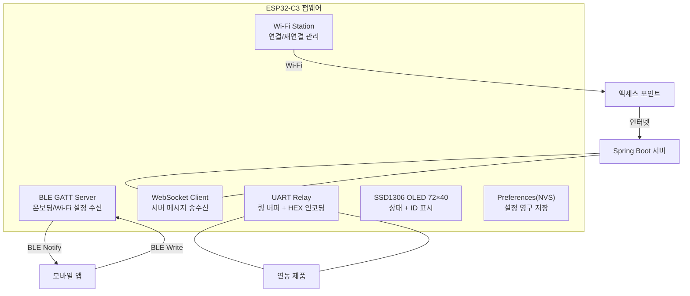
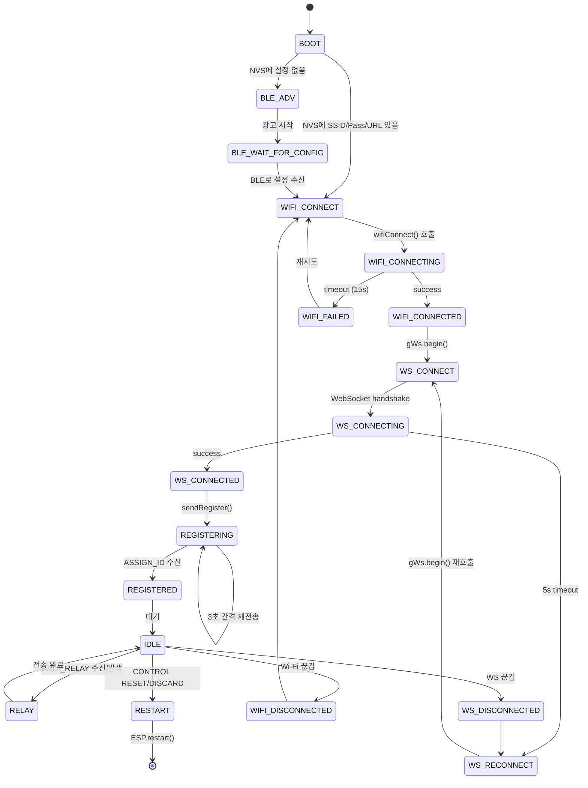
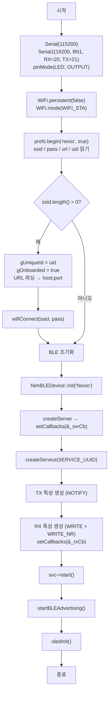

# ESP32-C3 펌웨어 설계 명세서

> **대상 보드**: 0.42인치 SSD1306 OLED (72×40) 탑재 ESP32-C3 보드
> **역할**: BLE 온보딩 → Wi-Fi 연결 → WebSocket 통신 → UART 데이터 중계 → OLED 상태 표시
> **언어**: Arduino(C++)

---

## 1. 시스템 개요


```mermaid
graph TB
    subgraph ESP32["ESP32-C3 펌웨어"]
        BLE["BLE GATT Server<br/>온보딩/Wi-Fi 설정 수신"]
        WIFI["Wi-Fi Station<br/>연결/재연결 관리"]
        WS["WebSocket Client<br/>서버 메시지 송수신"]
        UART["UART Relay<br/>링 버퍼 + HEX 인코딩"]
        OLED["SSD1306 OLED 72×40<br/>상태 + ID 표시"]
        NVS["Preferences(NVS)<br/>설정 영구 저장"]
    end

    PHONE["모바일 앱"] -->|BLE Write| BLE
    BLE -->|BLE Notify| PHONE
    WIFI -->|Wi-Fi| AP["액세스 포인트"]
    AP -->|인터넷| SERVER["Spring Boot 서버"]
    WS --- SERVER
    SERVER --- WS
    UART --- PRODUCT["연동 제품"]
    PRODUCT --- UART
```

### 동작 시나리오

| 단계 | 설명 |
|------|------|
| 1 | 보드 부팅 — OLED에 "Booting..." 표시 |
| 2 | NVS에 저장된 Wi-Fi 설정이 있으면 자동 연결 |
| 3 | 설정이 없으면 BLE 광고 시작 (이름: `Nexio`) |
| 4 | 모바일 앱이 BLE로 SSID/Password/ServerURL 전송 |
| 5 | 보드가 NVS에 저장 후 Wi-Fi 연결 시도 |
| 6 | Wi-Fi 연결 성공 → WebSocket 서버에 접속 |
| 7 | `REGISTER` 전송 → 서버가 `ASSIGN_ID`로 응답 |
| 8 | 등록 완료 후 UART ↔ WS 데이터 중계 시작 |
| 9 | 주기적 `HEARTBEAT`로 연결 유지 |
| 10 | Wi-Fi/WS 끊김 시 자동 재연결 |
| 11 | OLED에 `[W][S][P]` 상태 + Unique ID 실시간 표시 |

---

## 설계 보완 및 필수 수정 사항

설계서를 코드로 정확히 재현하기 위해 아래 항목들을 명확히 하였고, 구현 시 해당 규격을 따르십시오.

1) 인코딩(필수)
 - UART ↔ WebSocket 페이로드는 HEX 인코딩을 사용함(예: "48656C6C6F"). 프로젝트 전체에서 HEX로 통일되었음.
 - 이전에 사용되던 base64 방식은 사용하지 않음. 서버·클라이언트와 인터페이스할 때 반드시 HEX로 교환하세요.

2) WebSocket 구현 명세 (필수)
 - 라이브러리: `WebSocketsClient.h` 사용 (ESP32 Arduino 환경)
 - 이벤트 함수 시그니처: `wsEvent(WStype_t type, uint8_t* payload, size_t length)` 형태로 처리
 - 기본 WS 경로: `/ws/board` (URL 예시: `ws://HOST:PORT/ws/board`)
 - 메시지 타입별 JSON 규격(아래 섹션 참조)을 엄격히 준수

3) REGISTER / HEARTBEAT 기본값(필수)
 - `version` 필드는 `"1.0"`으로 고정
 - `displayAvailable`는 OLED 장착 보드는 `true`
 - `productConnected`는 런타임 값(`gProductConnected`)을 반영

4) StaticJsonDocument 크기 권장(권장)
 - 짧은 메시지(REGISTER, HEARTBEAT, DISCARD_ACK): 128~256 바이트 권장
 - 일반 텍스트/명령 처리: 512 바이트 권장
 - 긴 payload 처리(DATA_RELAY 등): 768~1536 바이트 권장
 - 코드에서는 예제별로 128/512/768이 혼용되므로 설계서와 일치시키도록 권장

5) 타이밍 상수(코드 상수명 명시)
 - `WIFI_TIMEOUT_MS` = 15000 (ms)
 - `WS_RECONNECT_INTERVAL` = 5000 (ms)
 - `REGISTER_RETRY_INTERVAL` = 3000 (ms)
 - `HEARTBEAT_INTERVAL` = 5000 (ms)
 - `LOOP_DELAY_MS` = 100 (ms)

6) NVS (Preferences) 사용 패턴
 - 읽기(boot 복원): `prefs.begin("nexio", true)` (read-only)
 - 쓰기(온보딩/ASSIGN_ID): `prefs.begin("nexio", false)` (read/write)
 - DISCARD 처리 시 `prefs.clear()` 호출 후 `prefs.end()`

7) 빌드·디렉터리 권장 (프로젝트 정책)
 - Arduino IDE로 개발 시: 단일 `firmware/firmware.ino` 파일을 권장
 - PlatformIO를 사용하려면 `src/` 구조를 별도 유지하되, 본 설계서는 Arduino 단일 파일 구현을 1차 권장으로 명시

8) 에러 처리·안전 검사(권장)
 - JSON 필드 접근 전 `const char*`의 null 체크: `const char* t = doc["type"]; if (!t) return;`
 - `strncpy`/`snprintf` 사용 시 버퍼 크기 검사 및 null 종료 보장
 - deserializeJson 실패 시 조기 반환

9) 라이브러리 및 최소 버전(권장)
 - NimBLE-Arduino >= 1.4.0
 - WebSockets (arduinoWebSockets) >= 0.5.2
 - ArduinoJson >= 6.18.0
 - U8g2 >= 2.29.10
 - Preferences: ESP32 Arduino core 내장 (사용 중인 ESP32 코어 버전 명시 권장)

10) 폰트/리소스(권장)
 - `u8g2_font_logisoso24_tf`는 프로젝트에 포함되지 않을 수 있음. 빌드 실패 방지를 위해 대체 폰트(예: `u8g2_font_fub11_tf`)를 권고하거나 폰트 포함 방법을 문서화하세요.

위 항목들은 코드와 설계서의 1:1 재현성을 보장하기 위한 필수·권장 변경입니다. 아래의 기존 하드웨어·모듈 문서가 이어집니다.

## 2. 하드웨어 구성

### 핀 배정

| ESP32-C3 핀 | 연결 대상 | 용도 | 비고 |
|-------------|----------|------|------|
| GPIO 8 | 온보드 LED | Wi-Fi 연결 표시 | HIGH=연결, LOW=미연결 |
| GPIO 5 | OLED SDA | I2C 데이터 | `Wire.begin(5, 6)` |
| GPIO 6 | OLED SCL | I2C 클록 | 400kHz |
| GPIO 21 | Serial1 TX | 제품 UART 송신 | `Serial1.write()` |
| GPIO 20 | Serial1 RX | 제품 UART 수신 | `Serial1.read()` |
| — | USB CDC | 디버그 콘솔 | `Serial.begin(115200)` |

### OLED — SSD1306 72×40

72×40 픽셀 SSD1306 컨트롤러를 내장한 OLED 모듈. `U8G2_SSD1306_72X40_ER_F_HW_I2C` 드라이버를 사용하며 오프셋 없이 네이티브 72×40 프레임버퍼로 구동한다.

| 항목 | 값 |
|------|-----|
| 라이브러리 | `U8g2` (`U8G2_SSD1306_72X40_ER_F_HW_I2C`) |
| 생성자 인자 | `U8G2_R0, U8X8_PIN_NONE, SCL=6, SDA=5` |
| X 오프셋 | 0 (네이티브 드라이버) |
| Y 오프셋 | 0 (네이티브 드라이버) |
| 가시 폭 | 72px (`OLED_WIDTH`) |
| 가시 높이 | 40px (`OLED_HEIGHT`) |
| I2C 속도 | 400kHz (`setBusClock`) |
| 대비 | 255 (최대) |

### UART 규격

| 항목 | 값 |
|------|-----|
| 인터페이스 | `Serial1` (하드웨어 UART1) |
| TX 핀 | GPIO 21 (`PRODUCT_UART_TX`) |
| RX 핀 | GPIO 20 (`PRODUCT_UART_RX`) |
| 전송 속도 | 19200 baud (기본값, 온보딩 시 변경 가능) |
| 데이터 비트 | 8 |
| 패리티 | 없음 (`SERIAL_8N1`) |
| 흐름 제어 | 없음 |

---

## 3. 소프트웨어 아키텍처

### 모듈 구조

```
firmware.ino (단일 파일 — 8개 모듈)
├── [1] 전방부 — Includes, Macros, 전역 변수, 전방 선언
├── [2] BLE    — NimBLE 서버/콜백, 알림, 광고, 상태 플래그
├── [3] Wi-Fi  — 연결/재연결
├── [4] WS     — WebSocket 송수신
├── [5] UART   — UART ↔ WS 중계
├── [6] OLED   — SSD1306 초기화 및 상태 표시
├── [7] 초기화 — setup()
└── [8] 루프   — loop()
```

### 라이브러리 의존성

| 라이브러리 | 역할 | 헤더 |
|-----------|------|------|
| NimBLE-Arduino | BLE GATT 서버 | `NimBLEDevice.h` |
| WiFi | Wi-Fi Station | `WiFi.h` |
| WebSockets | WebSocket 클라이언트 | `WebSocketsClient.h` |
| ArduinoJson 6.x | JSON 파싱 | `ArduinoJson.h` |
| Preferences | NVS 저장소 | `Preferences.h` |
| U8g2 | SSD1306 OLED 구동 | `U8g2lib.h` |
| Wire | I2C 통신 | `Wire.h` |

---

## 4. 상태 전이


```mermaid
stateDiagram-v2
    [*] --> BOOT

    BOOT --> BLE_ADV      : NVS에 설정 없음
    BOOT --> WIFI_CONNECT : NVS에 SSID/Pass/URL 있음

    BLE_ADV --> BLE_WAIT_FOR_CONFIG : 광고 시작
    BLE_WAIT_FOR_CONFIG --> WIFI_CONNECT : BLE로 설정 수신

    WIFI_CONNECT --> WIFI_CONNECTING : wifiConnect() 호출
    WIFI_CONNECTING --> WIFI_CONNECTED : success
    WIFI_CONNECTING --> WIFI_FAILED : timeout (15s)
    WIFI_FAILED --> WIFI_CONNECT : 재시도

    WIFI_CONNECTED --> WS_CONNECT : gWs.begin()
    WS_CONNECT --> WS_CONNECTING : WebSocket handshake
    WS_CONNECTING --> WS_CONNECTED : success
    WS_CONNECTING --> WS_RECONNECT : 5s timeout
    WS_RECONNECT --> WS_CONNECT : gWs.begin() 재호출

    WS_CONNECTED --> REGISTERING : sendRegister()
    REGISTERING --> REGISTERED : ASSIGN_ID 수신
    REGISTERING --> REGISTERING : 3초 간격 재전송

    REGISTERED --> IDLE : 대기
    IDLE --> RELAY : DATA_RELAY 수신/발생
    RELAY --> IDLE : 전송 완료

    IDLE --> WS_DISCONNECTED : WS 끊김
    WS_DISCONNECTED --> WS_RECONNECT

    IDLE --> WIFI_DISCONNECTED : Wi-Fi 끊김
    WIFI_DISCONNECTED --> WIFI_CONNECT

    IDLE --> RESTART : CONTROL RESET/DISCARD
    RESTART --> [*] : ESP.restart()
```

### OLED 상태 표시

OLED 상단에 Unique ID, 하단에 상태 표시줄을 그린다.

| 상태 | `[W]` | `[S]` | `[P]` |
|------|-------|-------|-------|
| 미연결 | `[ ]` | `[ ]]` | `[ ]` |
| 연결 | `[W]` | `[S]` | `[P]` |

- `[W]` — `gWifiConnected` (Wi-Fi 링크 연결)
- `[S]` — `gRegistered` (서버 ASSIGN_ID 수신)
- `[P]` — `gProductConnected` (UART 첫 바이트 수신)

### 상태 플래그 요약

| 플래그 | 변수 | Bit | 의미 |
|--------|------|-----|------|
| SVR | `gRegistered` | 0x02 | 서버가 ASSIGN_ID 전송 완료 |
| WIFI | `gWifiConnected` | 0x04 | Wi-Fi 연결됨 |
| CFG | `gOnboarded` | 0x08 | NVS에 설정 보관 중 |

이 플래그들은 BLE Manufacturer Data에 포함되어 모바일 앱이 보드 상태를 스캔만으로 파악할 수 있게 한다.

---

## 5. 전역 변수 명세

### 제품 UART 링 버퍼

```c
static const size_t  UART_BUF_SIZE    = 1024;   // 링 버퍼 크기
static       uint8_t uartRing[1024];             // 원형 큐 저장소
static       size_t  uartHead         = 0;       // 생산자 인덱스 (Serial1 → 버퍼)
static       size_t  uartTail         = 0;       // 소비자 인덱스 (버퍼 → WS)
```

링 버퍼가 가득 차면(`head + 1 == tail`) 새 바이트를 버린다.

### BLE GATT UUID

| UUID | 역할 | 방향 |
|------|------|------|
| `6e400001-b5a3-f393-e0a9-e50e24dcca9e` | 서비스 | — |
| `6e400002-b5a3-f393-e0a9-e50e24dcca9e` | TX 특성 | 보드 → 폰 (Notify) |
| `6e400003-b5a3-f393-e0a9-e50e24dcca9e` | RX 특성 | 폰 → 보드 (Write) |

### 연결/온보딩 상태

| 변수 | 타입 | 초기값 | 설명 |
|------|------|--------|------|
| `gUniqueId` | `char[32]` | `""` | 서버가 할당한 고유 ID (예: `"0042"`) |
| `gServerHost` | `char[64]` | `""` | WS 서버 호스트명 (포트 제외) |
| `gServerPort` | `uint16_t` | `0` | WS 서버 포트 번호 |
| `gOnboarded` | `bool` | `false` | NVS에 Wi-Fi 설정이 저장되어 있음 |
| `gStatusFlags` | `uint8_t` | `0` | BLE 광고용 비트마스크 (Bit 1/2/3) |
| `gWifiConnected` | `bool` | `false` | Wi-Fi 연결 상태 |
| `gWifiAttempted` | `bool` | `false` | `WiFi.begin()` 호출 여부 |
| `gWifiAttemptTime` | `unsigned long` | `0` | 마지막 Wi-Fi 연결 시도 시각 (ms) |
| `gWifiRetryCount` | `int` | `0` | 연결 실패 누적 횟수 (3회 초과 시 중단) |
| `gWifiRetryDone` | `bool` | `false` | 3회 재시도 후 더 이상 시도하지 않음 |
| `gRegistered` | `bool` | `false` | 서버 ASSIGN_ID 수신 완료 |
| `gBleConnected` | `bool` | `false` | BLE 링크 연결 상태 |
| `gBleAdvertising` | `bool` | `false` | BLE 광고 중 |
| `gPendingRestart` | `volatile bool` | `false` | RESET/DISCARD 명령 수신 → loop에서 소비 |
| `gProductConnected` | `bool` | `false` | 제품 UART 첫 바이트 수신 시 true |

### WebSocket 상태

| 변수 | 타입 | 초기값 | 설명 |
|------|------|--------|------|
| `gWsConnected` | `bool` | `false` | WS 링크 연결 상태 |
| `gWsConnectStart` | `unsigned long` | `0` | `gWs.begin()` 호출 시각 |

### OLED 핸들

| 변수 | 타입 | 설명 |
|------|------|------|
| `u8g2` | `U8G2_SSD1306_72X40_ER_F_HW_I2C` | OLED 제어 인스턴스 (네이티브 72×40) |

### 타이머

| 변수 | 타입 | 초기값 | 설명 |
|------|------|--------|------|
| `gLastServerMsg` | `unsigned long` | `0` | 마지막 HEARTBEAT/ASSIGN_ID 수신 시각 |
| `gLastRegister` | `unsigned long` | `0` | 마지막 REGISTER 전송 시각 |

### 핸들

| 변수 | 타입 | 설명 |
|------|------|------|
| `pTxChar` | `NimBLECharacteristic*` | `nullptr` | BLE TX 특성 (Notify 용) |
| `gWs` | `WebSocketsClient` | 기본 생성 | WS 클라이언트 인스턴스 |
| `prefs` | `Preferences` | 기본 생성 | NVS 읽기/쓰기 핸들 |

### 콜백 인스턴스

| 변수 | 타입 | 설명 |
|------|------|------|
| `_svrCb` | `SvrCb` | BLE 서버 접속/해제 콜백 |
| `_rxCb` | `RxCb` | BLE RX 쓰기 콜백 |

---

## 6. 모듈 상세

### [1] 전방부

**Includes** — 7개의 표준/외부 라이브러리를 include 한다.

**Macros:**
```c
#define LED_PIN              8   // GPIO 8 — Wi-Fi 연결 표시 LED
#define OLED_SDA             5   // OLED I2C 데이터
#define OLED_SCL             6   // OLED I2C 클록
#define OLED_WIDTH           72  // OLED 가시 폭
#define OLED_HEIGHT          40  // OLED 가시 높이
#define WIFI_TIMEOUT_MS  15000   // Wi-Fi 연결 시도 타임아웃 (ms)
#define PRODUCT_UART_TX      21  // Serial1 TX 핀
#define PRODUCT_UART_RX      20  // Serial1 RX 핀
#define PRODUCT_UART_BAUD    19200  // UART 전송 속도 (기본값, NVS "baud" 키로 오버라이드 가능)
```

**전방 선언** — 아래 함수들이 본문보다 먼저 사용되므로 선언한다:
- `startBLEAdvertising()`
- `bleNotify(const char*)`
- `updateStatusFlags()`
- `wifiConnect(const char* ssid, const char* pass)`
- `wsToUart(const char* payload, size_t len)`
- `updateDisplay()`

---

### [2] BLE

#### `SvrCb` — 서버 콜백 클래스

`NimBLEServerCallbacks` 상속, 두 이벤트 처리:

| 이벤트 | 동작 |
|--------|------|
| `onConnect` | `gBleConnected = true`, `Serial.println("[BLE] Connected")` |
| `onDisconnect` | `gBleConnected = false`, `startBLEAdvertising()` 재시작 |

#### `RxCb` — 특성 쓰기 콜백 클래스

`NimBLECharacteristicCallbacks` 상속, `onWrite` 하나로 모든 수신 처리.

BLE로 수신한 JSON 문자열을 파싱하여 **두 가지 유형**을 처리:

**유형 A — 액션 명령 (`"action"` 키 포함):**
```json
{ "action": "RESET" }
{ "action": "DISCARD" }
```

| 액션 | 동작 |
|------|------|
| `RESET` | `gPendingRestart = true` |
| `DISCARD` | `prefs.clear()`로 NVS 초기화 후 `gPendingRestart = true` |

**유형 B — 설정 (`"ssid"` 키 포함):**
```json
{
  "ssid": "MyWiFi",
  "password": "secret123",
  "serverUrl": "ws://192.168.1.100:10008/ws/board",
  "uniqueId": "0042",
  "baudRate": 19200
}
```

처리 순서:
1. 수신 전문을 USB CDC와 BLE Notify로 출력
2. `gUniqueId` 갱신 (optional)
3. NVS에 ssid/pass/url/uid/baud 저장
4. baudRate가 다르면 `Serial1.begin(newBaud)`로 제품 UART 속도 변경
5. `gOnboarded = true`, `updateStatusFlags()`
6. 같은 SSID가 아니면 `wifiConnect()` 호출

URL 파싱 로직:
```
입력: "ws://192.168.1.100:10008/ws/board"
         ↑ps=6  ↑pp(마지막:)
→ host: "192.168.1.100"  (:// 뒤 ~ : 전)
→ port: 10008            (: 뒤)
→ 후행 /와 포트 제거
```

#### `bleNotify(msg)`

BLE 연결 상태면 `pTxChar->notify()` 전송. USB CDC(`Serial.println`)에는 항상 출력.

#### `startBLEAdvertising()`

1. 기존 광고 중지
2. 디바이스명 설정: `gUniqueId`가 있으면 `"Nexio-0042"`, 없으면 `"Nexio"`
3. Manufacturer Data 설정: 회사 ID `0x02D5` + `gStatusFlags` 1바이트 + 예비 2바이트
4. 광고 시작, `gBleAdvertising = true`

#### `updateStatusFlags()`

```c
uint8_t f  = 0;
if (gRegistered)    f |= 0x02;   // Bit 1: SVR
if (gWifiConnected) f |= 0x04;   // Bit 2: WIFI
if (gOnboarded)     f |= 0x08;   // Bit 3: CFG
```

변화가 있고 광고 중이면 `startBLEAdvertising()` 재호출하여 스캐너가 새 상태를 감지하게 한다.

---

### [3] Wi-Fi

#### `wifiConnect(ssid, pass)`

1. `bleNotify("[WIFI] Connecting to %s...", ssid)`
2. `WiFi.mode(WIFI_STA)` — Station 모드
3. `WiFi.begin(ssid, pass)` — 연결 시작
4. `gWifiAttempted = true`, `gWifiAttemptTime = millis()`

연결 결과는 loop()에서 비동기로 감지한다. 차단 대기하지 않는다.

---

### [4] WebSocket

#### `sendRegister()`

등록 메시지 전송 — 연결 후 최초 1회 (또는 ack 없으면 3초마다 재전송).

```json
{
  "type": "REGISTER",
  "version": "1.0",
  "timestamp": 1700000,
  "boardId": "AA:BB:CC:DD:EE:FF",
  "firmwareVersion": "1.0.0",
  "displayAvailable": true,
  "productConnected": false,
  "uniqueId": "0042"
}
```

- `displayAvailable`: 항상 `true` (OLED 장착 보드)
- `productConnected`: `gProductConnected` 값 동적 반영
- `boardId`: `WiFi.macAddress()`로 채움
- `uniqueId`: 있을 때만 포함

#### `sendHeartbeat()`

5초 간격으로 전송. 서버는 9초 이내에 HEARTBEAT를 받지 못하면 연결을 끊는다.

```json
{
  "type": "HEARTBEAT",
  "version": "1.0",
  "timestamp": 1700000,
  "id": "0042"
}
```

#### `wsEvent(type, payload, length)`

| `WStype_t` | 동작 |
|-----------|------|
| `WStype_CONNECTED` | `gWsConnected = true`, 타이머 리셋, 재등록 대기 |
| `WStype_DISCONNECTED` | `gWsConnected = false`, `gRegistered = false` |
| `WStype_TEXT` | JSON 파싱 후 type 분기 (아래 표) |
| `WStype_PING` / `WStype_PONG` | 무시 |

**WStype_TEXT — type별 분기:**

| type | 필드 | 동작 |
|------|------|------|
| `ASSIGN_ID` | `uniqueId` | NVS/메모리에 저장, `gRegistered = true`, `updateStatusFlags()` |
| `HEARTBEAT` | — | `gLastServerMsg = millis()` |
| `CONTROL` | `action: "RESET"` | `gPendingRestart = true` |
| `CONTROL` | `action: "DISCARD"` | DISCARD_ACK 전송 → NVS 초기화 → `gPendingRestart = true` |
| `DATA_RELAY` | `payload` (HEX) | `wsToUart()` 호출 |

**DISCARD 처리 상세:**
1. 서버에 `DISCARD_ACK` JSON 전송
2. `delay(5)` — ACK 전송 보장
3. `prefs.clear()` — NVS 전체 삭제
4. `gPendingRestart = true`

---

### [5] UART 중계

#### `uartToWs()` — Serial1 → WS


```mermaid
graph LR
    PRODUCT["제품 UART"]
    RING["링 버퍼 (1024 bytes)"]
    HEX["HEX 인코딩 %02X"]
    WS["WebSocket → 서버"]

    PRODUCT -->|바이트 단위| RING
    RING -->|최대 240 bytes| HEX
    HEX -->|DATA_RELAY JSON| WS
```

상세:
1. `Serial1.available()` 동안 읽어 링 버퍼에 저장 (overflow 시 버림)
2. 버퍼가 비었거나 WS/등록 미완료면 return
3. 첫 바이트 수신 시 `gProductConnected = true` 설정, `updateDisplay()` 호출
4. 읽을 수 있는 최대 크기 계산: `(head - tail) % UART_BUF_SIZE`, 최대 240바이트
5. 각 바이트를 `%02X`로 HEX 인코딩하여 문자열 생성
6. `DATA_RELAY` JSON으로 WS 전송
7. 소비자 인덱스(tail) 전진

전송 JSON:
```json
{
  "type": "DATA_RELAY",
  "payload": "48656C6C6F",
  "direction": "uart_to_server"
}
```

#### `wsToUart(payload, len)` — WS → Serial1

1. HEX 문자열을 2문자씩 읽어 `strtoul(, 16)`로 1바이트 디코딩
2. `Serial1.write(b)`로 출력
3. 종료 후 `Serial1.flush()`

---

### [6] OLED

#### `oledInit()`

setup()에서 BLE 초기화 직후 호출된다. 72×40 네이티브 드라이버를 사용하며 별도의 I2C 초기화가 필요하지 않다 (`U8X8_PIN_NONE`으로 U8g2가 자체 I2C 초기화).

1. `u8g2.begin()` — 디스플레이 초기화
2. `u8g2.setContrast(255)` — 최대 밝기
3. `u8g2.setBusClock(400000)` — I2C 400kHz
4. `u8g2.clearBuffer()` → `u8g2.setFont(u8g2_font_5x7_tr)` → `u8g2.print("Booting...")` → `u8g2.sendBuffer()`

#### `updateDisplay()`

loop()에서 매 100ms마다 호출된다.

**레이아웃 (네이티브 72×40 버퍼):**

```
┌──────────────────────┐
│      0042            │  ← 24px ID (logisoso24), Y=26
│                      │
│    [W][S][P]         │  ← 10px status (6x10), Y=38
└──────────────────────┘
```

- **하단**(Y=26): `u8g2_font_6x10_tr` — `[W][S][P]` 상태 (중앙 정렬)
- **상단**(Y=38): `u8g2_font_logisoso24_tf` — Unique ID (없으면 `"----"`, 중앙 정렬)

`gProductConnected`가 UART 첫 바이트 수신 시 `true`로 설정되며, `[P]`가 활성화된다.

참고: 72×40 네이티브 드라이버이므로 별도의 X/Y 오프셋 보정이 필요하지 않다. 이전 128×64+오프셋 방식에서 단순화되었다.

---

### [7] 초기화 — `setup()`


```mermaid
graph TD
    START["시작"]
    SERIAL["Serial(115200)<br/>Serial1(19200, 8N1, RX=20, TX=21)<br/>pinMode(LED, OUTPUT)"]
    WIFI_INIT["WiFi.persistent(false)<br/>WiFi.mode(WIFI_STA)"]
    NVS_READ["prefs.begin('nexio', true)<br/>ssid / pass / url / uid 읽기"]
    HAS_CONFIG{"ssid.length() > 0?"}
    RESTORE["gUniqueId = uid<br/>gOnboarded = true<br/>URL 파싱 → host:port"]
    WIFI_CALL["wifiConnect(ssid, pass)"]
    BLE_INIT["BLE 초기화"]
    BLE1["NimBLEDevice::init('Nexio')"]
    BLE2["createServer → setCallbacks(&_svrCb)"]
    BLE3["createService(SERVICE_UUID)"]
    BLE4["TX 특성 생성 (NOTIFY)"]
    BLE5["RX 특성 생성 (WRITE + WRITE_NR)<br/>setCallbacks(&_rxCb)"]
    BLE6["svc->start()"]
    ADV["startBLEAdvertising()"]
    OLED_INIT["oledInit()"]
    DONE["종료"]

    START --> SERIAL
    SERIAL --> WIFI_INIT
    WIFI_INIT --> NVS_READ
    NVS_READ --> HAS_CONFIG
    HAS_CONFIG -->|예| RESTORE
    RESTORE --> WIFI_CALL
    WIFI_CALL --> BLE_INIT
    HAS_CONFIG -->|아니오| BLE_INIT
    BLE_INIT --> BLE1
    BLE1 --> BLE2
    BLE2 --> BLE3
    BLE3 --> BLE4
    BLE4 --> BLE5
    BLE5 --> BLE6
    BLE6 --> ADV
    ADV --> OLED_INIT
    OLED_INIT --> DONE
```

---

### [8] 메인 루프 — `loop()`

매 반복(100ms delay)마다 아래 항목을 순차 처리:


```mermaid
graph TD
    START["loop() 시작"]
    RESTART_CHECK{"gPendingRestart?"}
    RESTART["delay(100)<br/>ESP.restart()"]
    WS_LOOP["gWs.loop()"]
    UART_WS["uartToWs()"]
    WIFI_CONN{"Wi-Fi 막 연결됨?"}
    WIFI_CONN_ACT["gWifiConnected = true<br/>updateStatusFlags()<br/>gWs.begin() → wsEvent 설정"]
    WIFI_DISC{"Wi-Fi 막 끊김?"}
    WIFI_DISC_ACT["gWifiConnected = false<br/>gWs.disconnect()<br/>updateStatusFlags()"]
    WIFI_TIMEOUT{"Wi-Fi 타임아웃?"}
    WIFI_TIMEOUT_ACT["gWifiAttempted = false<br/>알림"]
    WIFI_RETRY{"Wi-Fi 재시도 필요?"}
    WIFI_RETRY_ACT["NVS 읽기 → wifiConnect()"]
    WS_RECON{"WS 재연결 필요?"}
    WS_RECON_ACT["gWs.disconnect()<br/>gWs.begin() 재호출"]
    REG{"REGISTER 전송 필요?"}
    REG_ACT["sendRegister()"]
    HB{"HEARTBEAT 전송 필요?"}
    HB_ACT["sendHeartbeat()"]
    LED["digitalWrite(LED, WiFi 상태)"]
    OLED_DISP["updateDisplay()"]
    DELAY["delay(100)"]

    START --> RESTART_CHECK
    RESTART_CHECK -->|예| RESTART
    RESTART_CHECK -->|아니오| WS_LOOP
    WS_LOOP --> UART_WS
    UART_WS --> WIFI_CONN
    WIFI_CONN -->|연결됨| WIFI_CONN_ACT
    WIFI_CONN_ACT --> WIFI_DISC
    WIFI_CONN --> WIFI_DISC
    WIFI_DISC -->|끊김| WIFI_DISC_ACT
    WIFI_DISC_ACT --> WIFI_TIMEOUT
    WIFI_DISC --> WIFI_TIMEOUT
    WIFI_TIMEOUT -->|예| WIFI_TIMEOUT_ACT
    WIFI_TIMEOUT_ACT --> WIFI_RETRY
    WIFI_TIMEOUT --> WIFI_RETRY
    WIFI_RETRY -->|예| WIFI_RETRY_ACT
    WIFI_RETRY_ACT --> WS_RECON
    WIFI_RETRY --> WS_RECON
    WS_RECON -->|5초 초과| WS_RECON_ACT
    WS_RECON_ACT --> REG
    WS_RECON --> REG
    REG -->|3초 간격| REG_ACT
    REG_ACT --> HB
    REG --> HB
    HB -->|5초 간격| HB_ACT
    HB_ACT --> LED
    HB --> LED
    LED --> OLED_DISP
    OLED_DISP --> DELAY
    DELAY --> START
```

#### 루프 세부 조건표

| 조건 | 변수 | 동작 |
|------|------|------|
| RESET/DISCARD | `gPendingRestart` | `ESP.restart()` |
| Wi-Fi 연결 감지 | `WiFi.status() == WL_CONNECTED && !gWifiConnected` | 상태 갱신, WS 접속 시작 |
| Wi-Fi 끊김 감지 | `WiFi.status() != WL_CONNECTED && gWifiConnected` | 상태 갱신, WS 해제 |
| Wi-Fi 타임아웃 | `!gWifiConnected && gWifiAttempted && 경과 > 15000ms` | 재시도 대기 |
| Wi-Fi 재시도 | `!gWifiConnected && !gWifiAttempted && gOnboarded` | NVS에서 읽어 `wifiConnect()` |
| WS 재연결 | `gWifiConnected && !gWsConnected && 경과 > 5000ms` | `gWs.begin()` 재호출 |
| REGISTER 전송 | `gWsConnected && !gRegistered && 경과 > 3000ms` | `sendRegister()` |
| HEARTBEAT 전송 | `gRegistered && 경과 > 5000ms` | `sendHeartbeat()` |
| LED 표시 | — | Wi-Fi 연결 시 HIGH |
| OLED 갱신 | — | `updateDisplay()` 호출 |

---

## 7. 메시지 프로토콜

### BLE (모바일 앱 → 보드)

쓰기(`CHAR_RX_UUID`)를 통해 JSON 전송:

**설정 (config):**
```json
{
  "ssid": "MyWiFi",
  "password": "secret123",
  "serverUrl": "ws://192.168.1.100:10008/ws/board",
  "uniqueId": "0042"
}
```
- `serverUrl` 형식: `ws://HOST:PORT/PATH`
- `uniqueId`는 선택 사항

**액션:**
```json
{ "action": "RESET" }
{ "action": "DISCARD" }
```

### BLE (보드 → 모바일 앱)

알림(`CHAR_TX_UUID`)으로 상태 메시지 전송:
```
[BLE] Connected
[BLE] Disconnected
[BLE] Advertising started
[CMD] RESET
[CMD] DISCARD
[CFG] ssid=MyWiFi pass=... url=... uid=0042
[WIFI] Connecting to MyWiFi...
[WIFI] Connected to MyWiFi, IP: 192.168.1.42, MAC: AA:BB:CC:DD:EE:FF
[WIFI] Connection failed (timeout)
[WS] Connected
[WS] Disconnected
[WS] Reconnecting...
[SVR] Registered as 0042
```

### BLE Manufacturer Data

광고 패킷에 포함되는 5바이트:
```
Bytes 0-1: 회사 ID 0x02D5 (Little Endian)
Byte 2:   상태 플래그 (Bit 1=SVR, Bit 2=WIFI, Bit 3=CFG)
Bytes 3-4: 예비 (0x00)
```

### WebSocket (보드 → 서버)

**REGISTER:**
```json
{
  "type": "REGISTER",
  "version": "1.0",
  "timestamp": 1700000,
  "boardId": "AA:BB:CC:DD:EE:FF",
  "firmwareVersion": "1.0.0",
  "displayAvailable": true,
  "productConnected": false,
  "uniqueId": "0042"
}
```

**HEARTBEAT:**
```json
{
  "type": "HEARTBEAT",
  "version": "1.0",
  "timestamp": 1700000,
  "id": "0042"
}
```

**DATA_RELAY (UART → 서버):**
```json
{
  "type": "DATA_RELAY",
  "payload": "48656C6C6F",
  "direction": "uart_to_server"
}
```

**DISCARD_ACK:**
```json
{
  "type": "DISCARD_ACK",
  "timestamp": 1700000,
  "id": "0042"
}
```

### WebSocket (서버 → 보드)

**ASSIGN_ID:**
```json
{
  "type": "ASSIGN_ID",
  "uniqueId": "0042"
}
```

**HEARTBEAT:**
```json
{
  "type": "HEARTBEAT"
}
```

**CONTROL:**
```json
{ "type": "CONTROL", "action": "RESET" }
{ "type": "CONTROL", "action": "DISCARD" }
```

**DATA_RELAY (서버 → UART):**
```json
{
  "type": "DATA_RELAY",
  "payload": "48656C6C6F"
}
```
`payload`는 HEX로 인코딩된 바이트 문자열.

---

## 8. NVS 키 레이아웃

Namespace: `"nexio"`

| Key | 타입 | 내용 |
|-----|------|------|
| `ssid` | String | Wi-Fi SSID |
| `pass` | String | Wi-Fi 비밀번호 |
| `url` | String | WebSocket 서버 URL |
| `uid` | String | 서버 할당 고유 ID |
| `baud` | ULong | 제품 UART Baud Rate (기본값: 19200) |

읽기/쓰기 모드:

| 함수 | 모드 | 목적 |
|------|------|------|
| `setup()` | `true` (읽기 전용) | 저장된 설정 복원 |
| `RxCb::onWrite` | `false` (읽기/쓰기) | 설정 저장 |
| `wsEvent (ASSIGN_ID)` | `false` | uid 갱신 |
| `wifiConnect 재시도` | `true` | SSID/Pass 읽기 |
| `DISCARD` | `false` | `clear()` 전체 삭제 |

---

## 9. 에러 처리

| 장애 | 감지 조건 | 복구 동작 |
|------|----------|-----------|
| Wi-Fi 연결 실패 | `millis() - gWifiAttemptTime > 15000` | 3회까지 재시도. 모두 실패 시 BLE 광고 모드로 대기 |
| Wi-Fi 연결 끊김 | `WiFi.status() != WL_CONNECTED` | 연결 시도 재개 (retry count 초기화) |
| WS 연결 실패 | `gWsConnectStart > 0 && 경과 > 5000` | `gWs.begin()` 재호출 |
| WS 연결 끊김 | `WStype_DISCONNECTED` | 다음 루프에서 재연결 |
| REGISTER 미승인 | 3초 경과 시 미등록 상태 | `sendRegister()` 재전송 |
| 링 버퍼 오버플로 | `(head + 1) % SIZE == tail` | 가장 오래된 데이터 대신 새 데이터 버림 |

---

## 10. LED 표시

| Wi-Fi 상태 | LED (GPIO 8) |
|-----------|-------------|
| 연결됨 (`WL_CONNECTED`) | `HIGH` (켜짐) |
| 미연결 | `LOW` (꺼짐) |

---

## 11. OLED 표시

### 레이아웃

SSD1306 72×40 네이티브 프레임버퍼. 오프셋 보정 불필요.

```
Physical Y
   0     ┌──────────────────────┐
         │    [W][S][P]         │  ← 6x10 (10px), Y=26
  26     ├──────────────────────┤
         │      0042            │  ← logisoso24 (24px), Y=38
  38     └──────────────────────┘
```

### 표시 항목

| 위치 | 폰트 | 내용 | 조건 |
|------|------|------|------|
| 하단(Y=38) | `logisoso24_tf` (24px) | Unique ID (예: `0042`) | 미할당 시 `----` |
| 상단(Y=26) | `6x10_tr` (10px) | `[W][S][P]` | 각 연결 시 해당 글자 표시 |

`[W]`: `gWifiConnected`, `[S]`: `gRegistered`, `[P]`: `gProductConnected`

참고: `gProductConnected`는 UART 첫 바이트 수신 시 `true`로 설정되어 `[P]`가 활성화된다.

---

## 12. 타이밍 상수

| 상수 | 값 | 용도 |
|------|----|------|
| `WIFI_TIMEOUT_MS` | 15000 ms | Wi-Fi 연결 시도 타임아웃 (3회 재시도, 총 45초) |
| WS 재연결 대기 | 5000 ms | WS handshake 타임아웃 |
| REGISTER 재시도 간격 | 3000 ms | 등록 ack 재시도 |
| HEARTBEAT 전송 간격 | 5000 ms | 서버 생존 신호 |
| 서버 HEARTBEAT 타임아웃 | 9000 ms (서버 측) | 서버가 연결을 끊는 기준 |
| `loop()` 지연 | 100 ms | 메인 루프 주기 |

---

## 13. 단어장

| 용어 | 원문 | 설명 |
|------|------|------|
| NVS | Non-Volatile Storage | ESP32의 비휘발성 저장소. 전원이 꺼져도 데이터 유지. 키-값 쌍으로 저장. 본 펌웨어에서는 SSID, 비밀번호, 서버 URL, 고유 ID를 보관 |
| BLE | Bluetooth Low Energy | 저전력 블루투스 통신. 본 펌웨어에서는 모바일 앱이 Wi-Fi 설정을 전달하는 온보딩 수단으로 사용 |
| GATT | Generic Attribute Profile | BLE 위에서 동작하는 데이터 통신 규격. 서비스(Service)와 특성(Characteristic)으로 구성 |
| UUID | Universally Unique Identifier | 128비트 고유 식별자. BLE 서비스와 특성을 구분하는 데 사용 |
| GATT Server | — | BLE 연결에서 데이터를 제공하는 역할. 본 펌웨어가 GATT 서버가 되어 모바일 앱의 요청을 수신 |
| Characteristic | — | GATT 서비스 내의 데이터 항목. TX(Notify)는 보드→폰, RX(Write)는 폰→보드 방향 |
| Notify | — | BLE GATT 서버가 클라이언트(모바일 앱)에게 능동적으로 데이터를 보내는 방식. Subscribe 필요 |
| Advertising | — | BLE 장치가 주변에 자신의 존재를 알리기 위해 주기적으로 방송하는 신호. 스캐너가 이 신호를 감지하여 연결 |
| Manufacturer Data | — | BLE 광고 패킷에 포함되는 제조사 정의 데이터. 본 펌웨어는 상태 플래그를 이 데이터에 실어 모바일 앱이 스캔만으로 상태를 파악 가능 |
| SSID | Service Set Identifier | Wi-Fi 네트워크 이름 |
| STA | Station | Wi-Fi 클라이언트 모드. 공유기에 연결되는 역할 |
| WebSocket | — | TCP 위에서 동작하는 양방향 실시간 통신 프로토콜. HTTP로 시작한 후 WS/WSS로 업그레이드 |
| WSS | WebSocket Secure | TLS 암호화된 WebSocket 연결 |
| Handshake | — | WebSocket 연결을 확립하기 위한 초기 HTTP 업그레이드 과정 |
| Heartbeat | — | 연결 유지를 위해 주기적으로 주고받는 생존 신호 메시지 |
| HEX 인코딩 | Hexadecimal | 바이너리 데이터를 16진수 문자열로 변환하는 방식. 예: `0x48 0x65` → `"4865"` |
| Ring Buffer | Circular Buffer | 고정 크기의 원형 큐. 생산자(Producer)가 쓰고 소비자(Consumer)가 읽는 구조. head/tail 인덱스로 관리 |
| JSON | JavaScript Object Notation | `key: value` 쌍으로 구성된 경량 데이터 교환 형식. 본 펌웨어의 모든 메시지에 사용 |
| Preferences | — | ESP32 Arduino에서 NVS에 접근하기 위한 라이브러리. `begin(namespace, readOnly)`로 열고 `getString/putString` 등으로 읽기/쓰기 |
| NimBLE | — | Apache NimBLE 기반의 ESP32 BLE 라이브러리. 기존 Bluedroid보다 가볍고 메모리 효율이 좋음 |
| ArduinoJson | — | JSON 문자열을 파싱하고 생성하는 C++ 라이브러리. `StaticJsonDocument<크기>`로 정적 메모리 할당 |
| USB CDC | USB Communication Device Class | USB를 가상 시리얼 포트로 사용하는 방식. `Serial.begin()`으로 초기화 |
| Serial1 | — | ESP32의 두 번째 하드웨어 UART. GPIO 20(RX), 21(TX)에 연결 |
| GPIO | General Purpose Input/Output | 범용 입출력 핀. 디지털 신호를 읽거나 쓸 수 있는 물리적 핀 |
| U8g2 | — | SSD1306 등 단색 OLED/ LCD를 구동하는 C++ 라이브러리. I2C/SPI 지원, 다양한 폰트 내장 |
| OTA | Over-The-Air | 무선으로 펌웨어를 업데이트하는 기능. (본 펌웨어에서는 미사용) |
