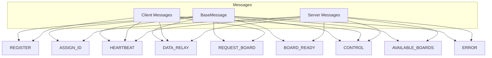

# Shared Types Design

## Overview

Shared TypeScript types and constants used across all components (Server, Client, Web). Ensures type-safe communication.

## Message Type Hierarchy



## Base Message Structure

```typescript
interface BaseMessage {
  type: MessageType;
  version: string;
  timestamp: number;
}
```

## Message Types

### REGISTER (Board → Server)

```json
{
  "type": "REGISTER",
  "version": "1.0",
  "timestamp": 1700000000000,
  "boardId": "AA:BB:CC:DD:EE:FF",
  "firmwareVersion": "1.0.0",
  "displayAvailable": true
}
```

### ASSIGN_ID (Server → Board)

```json
{
  "type": "ASSIGN_ID",
  "version": "1.0",
  "timestamp": 1700000000000,
  "uniqueId": "BOARD-0001",
  "serverTime": 1700000000000
}
```

### HEARTBEAT (Bidirectional)

```json
{
  "type": "HEARTBEAT",
  "version": "1.0",
  "timestamp": 1700000000000,
  "id": "BOARD-0001"
}
```

### DATA_RELAY (Bidirectional)

```json
{
  "type": "DATA_RELAY",
  "version": "1.0",
  "timestamp": 1700000000000,
  "sessionId": "SESSION-ABC123",
  "sourceId": "BOARD-0001",
  "direction": "B_TO_C",
  "payload": "base64encodedBinaryData=="
}
```

### REQUEST_BOARD (Client → Server)

```json
{
  "type": "REQUEST_BOARD",
  "version": "1.0",
  "timestamp": 1700000000000,
  "clientId": "CLIENT-XYZ",
  "sessionDuration": 3600
}
```

### BOARD_READY (Server → Client/Board)

```json
{
  "type": "BOARD_READY",
  "version": "1.0",
  "timestamp": 1700000000000,
  "boardId": "BOARD-0001",
  "sessionId": "SESSION-ABC123",
  "assignedAt": 1700000000000,
  "expiresAt": 1700003600000
}
```

### CONTROL (Server → Board/Client)

```json
{
  "type": "CONTROL",
  "version": "1.0",
  "timestamp": 1700000000000,
  "targetId": "BOARD-0001",
  "action": "RESET",
  "reason": "admin_request"
}
```

### AVAILABLE_BOARDS (Server → Client)

```json
{
  "type": "AVAILABLE_BOARDS",
  "version": "1.0",
  "timestamp": 1700000000000,
  "boards": [
    { "uniqueId": "BOARD-0001", "status": "IDLE", "connectedAt": 1700000000000 },
    { "uniqueId": "BOARD-0002", "status": "IDLE", "connectedAt": 1699990000000 }
  ]
}
```

### ERROR (Server → Client/Board)

```json
{
  "type": "ERROR",
  "version": "1.0",
  "timestamp": 1700000000000,
  "code": "BOARD_NOT_FOUND",
  "message": "Requested board is not available"
}
```

## Constants

```typescript
// Message version
const MESSAGE_VERSION = '1.0';

// WebSocket paths
const WEBSOCKET_PATHS = {
  BOARD: '/ws/board',
  CLIENT: '/ws/client',
};

// BLE UUIDs
const BLE_UUID = {
  SERVICE: '6e400001-b5a3-f393-e0a9-e50e24dcca9e',
  CHAR_TX: '6e400002-b5a3-f393-e0a9-e50e24dcca9e',
  CHAR_RX: '6e400003-b5a3-f393-e0a9-e50e24dcca9e',
};

// Timing
const HEARTBEAT_INTERVAL_MS = 30000;
const HEARTBEAT_TIMEOUT_MS = 60000;
const WIFI_RECONNECT_INTERVAL_MS = 3000;
const WS_RECONNECT_INTERVAL_MS = 5000;
```

## Enums

```typescript
type BoardStatus = 'IDLE' | 'BUSY' | 'OFFLINE';
type ClientStatus = 'CONNECTED' | 'DISCONNECTED';
type SessionStatus = 'ACTIVE' | 'EXPIRED' | 'TERMINATED';
type DataDirection = 'B_TO_C' | 'C_TO_B';
type ControlAction = 'RESET' | 'DISCONNECT' | 'PING';
```

## Error Codes

| Code | Description |
|------|-------------|
| BOARD_NOT_FOUND | Requested board not available |
| CLIENT_NOT_FOUND | Client not found |
| SESSION_NOT_FOUND | Session not found |
| BOARD_NOT_IDLE | Board is busy |
| SESSION_EXPIRED | Session has expired |
| INVALID_MESSAGE | Invalid message format |
| INTERNAL_ERROR | Server internal error |

## Usage

```typescript
import {
  MESSAGE_VERSION,
  type RegisterMessage,
  type DataRelayMessage,
  isClientMessage,
} from '@nexio/shared-types';

// Create message
const msg: RegisterMessage = {
  type: 'REGISTER',
  version: MESSAGE_VERSION,
  timestamp: Date.now(),
  boardId: 'AA:BB:CC:DD:EE:FF',
  firmwareVersion: '1.0.0',
  displayAvailable: true,
};

// Type guard
if (isClientMessage(msg)) {
  // Handle client message
}
```